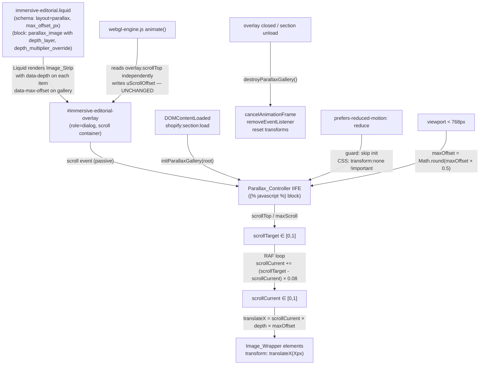

# Design Document: Editorial Parallax Gallery

## Overview

This feature adds a **scroll-driven horizontal parallax image strip** to the hero section of each room's editorial overlay in the Shahana Collection immersive store. When a shopper scrolls the editorial overlay (`#immersive-editorial-overlay`), a horizontal strip of 3–6 merchant-configured images translates at different speeds based on their assigned depth layer — foreground images move faster than background images — creating a cinematic, layered depth effect.

The feature is implemented as a CSS + vanilla JS enhancement scoped entirely within `sections/immersive-editorial.liquid`. It is opt-in via a new `parallax` value on the existing `layout` section setting. The Liquid template renders the image strip server-side; JavaScript adds the `transform: translateX()` animation on top. The feature degrades gracefully to a static scrollable layout when JavaScript is disabled or when `prefers-reduced-motion: reduce` is active.

### Key design decisions

**CSS + vanilla JS in `` block, not WebGL.** The parallax effect is a DOM-level horizontal translation — exactly the kind of effect the project's architecture reserves for CSS/DOM rather than WebGL. The controller is an IIFE scoped to the `` block of `immersive-editorial.liquid`, consistent with how other section-scoped behaviors (coverflow, stacked, perspective) are implemented in this theme.

**Independent scroll reading from `overlay.scrollTop`.** The controller reads `scrollTop` directly from `#immersive-editorial-overlay` and maintains its own `scrollTarget`/`scrollCurrent` lerp state. It does not read from or write to `editorialScrollProgress` or any WebGL uniform in `webgl-engine.js`. This strict isolation ensures the existing scroll-sinking shader effect is completely unaffected.

**Lerp factor 0.08 for cinematic smoothness.** The same lerp factor used by the WebGL pointer parallax (`lerpFactor = 0.08`) is applied here, giving the parallax strip the same fluid, cinematic feel as the rest of the immersive experience. The loop snaps `scrollCurrent` to `scrollTarget` when within 0.001 to avoid infinite micro-updates.

**`requestAnimationFrame` loop with passive scroll listener.** The scroll event listener is attached with `{ passive: true }` to avoid blocking the browser's scroll thread. The RAF loop handles all DOM writes, preventing layout thrashing.

**Block-driven merchant configuration.** Each image is a `parallax_image` block with an image picker, optional alt text, a depth layer select (background/midground/foreground), and an optional numeric override for fine-grained depth control. A section-level `max_offset_px` setting lets merchants tune overall parallax intensity without touching code.

**Mobile `maxOffset` halving.** On viewports narrower than 768px, `maxOffset` is halved to prevent images from translating too far off-screen. This is computed once at init time, not per-frame.

---

## Architecture

The feature modifies two existing files and adds translation keys to two locale files:

```
sections/immersive-editorial.liquid    — modified: parallax layout branch, new block type, JS controller, CSS
locales/en.default.json                — modified: runtime strings (none needed — no user-facing text in controller)
locales/en.default.schema.json         — modified: schema label translations for new settings and block
```

No new asset files are created. No changes to `webgl-engine.js`, `immersive-store.js`, `room-manager.js`, or any snippet.



---

## Components and Interfaces

### 1. Parallax_Controller (IIFE in ``)

The controller is a self-contained IIFE. It exposes no global API — all state is module-private. It is re-entrant via `destroyParallaxGallery()` + `initParallaxGallery()` on `shopify:section:load`.

**Module-level state:**

```javascript
var DEPTH_MULTIPLIERS = { background: 0.2, midground: 0.5, foreground: 1.0 };
var scrollTarget = 0;      // normalised [0,1] — updated by scroll listener
var scrollCurrent = 0;     // normalised [0,1] — lerped toward scrollTarget each frame
var rafId = null;           // requestAnimationFrame handle; null when loop is idle
var overlay = null;         // #immersive-editorial-overlay element reference
var items = [];             // Array of Image_Wrapper elements with data-depth
var maxOffset = 120;        // px — read from data-max-offset, halved on mobile
var reduceMotion = window.matchMedia('(prefers-reduced-motion: reduce)').matches;
```

**`initParallaxGallery(root)`** — called on DOMContentLoaded and `shopify:section:load`:
1. Finds `[data-parallax-gallery]` within `root`; returns if absent.
2. Finds `#immersive-editorial-overlay`; returns if absent (silent exit, no error).
3. Returns if `reduceMotion` is true.
4. Reads `data-max-offset` from the gallery element; halves it if `window.innerWidth < 768`.
5. Collects all `[data-depth]` items; returns if none found.
6. Attaches `scroll` listener to `overlay` with `{ passive: true }`.
7. Calls `startRaf()`.

**`onScroll()`** — scroll event handler:
- Computes `scrollTarget = overlay.scrollTop / (overlay.scrollHeight - overlay.clientHeight)`.
- Guards against division by zero when `maxScroll <= 0`.

**`startRaf()`** — starts the RAF loop if not already running:
- Each frame: lerps `scrollCurrent` toward `scrollTarget` with factor 0.08.
- Snaps `scrollCurrent = scrollTarget` when `|scrollCurrent - scrollTarget| < 0.0001`.
- Applies `transform: translateX(Xpx)` to each item where `X = scrollCurrent × depth × maxOffset`.
- Schedules next frame via `requestAnimationFrame`.

**`destroyParallaxGallery()`** — called on overlay close and before re-init:
- Cancels RAF loop (`cancelAnimationFrame(rafId); rafId = null`).
- Removes `scroll` listener from `overlay`.
- Resets all item transforms to `''`.
- Resets `items`, `overlay`, `scrollTarget`, `scrollCurrent` to initial values.

### 2. Image_Strip HTML (Liquid-rendered)

The strip is rendered server-side by Liquid inside the `immersive-editorial__hero` element when `layout == 'parallax'` and at least 3 `parallax_image` blocks are present. The Liquid template caps rendering at 6 blocks using a `forloop.index` guard.

Key data attributes:
- `data-parallax-gallery` on the `.immersive-parallax-gallery` container — used by JS to locate the gallery.
- `data-max-offset` on the container — carries the merchant-configured `max_offset_px` value.
- `data-depth` on each `.immersive-parallax-gallery__item` — carries the resolved depth multiplier (either the named preset or the override value), computed in Liquid.

### 3. Depth multiplier resolution (Liquid)

For each `parallax_image` block, the depth multiplier is resolved in Liquid before being written to `data-depth`:

```
if depth_multiplier_override > 0 → use depth_multiplier_override
else if depth_layer == 'background' → 0.2
else if depth_layer == 'foreground' → 1.0
else (midground or default) → 0.5
```

This means the JS controller is purely numeric — it reads `parseFloat(item.getAttribute('data-depth'))` and never needs to know about named layers.

### 4. Section schema additions

**New block type `parallax_image`:**

| Setting | Type | Default | Notes |
|---|---|---|---|
| `image` | image_picker | — | The gallery image |
| `alt` | text | `''` | Optional alt text override |
| `depth_layer` | select | `midground` | Options: background, midground, foreground |
| `depth_multiplier_override` | range | `0` | 0.0–1.0, step 0.05; 0 means use preset |

**New section-level setting:**

| Setting | Type | Default | Notes |
|---|---|---|---|
| `max_offset_px` | range | `120` | 40–240, step 10; overall parallax intensity in px |

**Modified section-level setting:**

The existing `layout` select gains a new option: `{ "value": "parallax", "label": "t:..." }`.

### 5. Locale keys

New keys added to `locales/en.default.schema.json` under `sections.immersive_editorial`:

```json
"settings": {
  "layout": {
    "option_parallax": "Parallax Gallery"
  },
  "max_offset_px": {
    "label": "Parallax intensity (px)",
    "info": "Maximum horizontal translation for foreground images. Halved automatically on mobile."
  }
},
"blocks": {
  "parallax_image": {
    "name": "Parallax image",
    "settings": {
      "image": { "label": "Image" },
      "alt": { "label": "Alt text", "info": "Overrides the image's default alt text." },
      "depth_layer": {
        "label": "Depth layer",
        "option_background": "Background (slow)",
        "option_midground": "Midground (medium)",
        "option_foreground": "Foreground (fast)"
      },
      "depth_multiplier_override": {
        "label": "Custom depth multiplier",
        "info": "Set above 0 to override the depth layer preset. 0 = use preset."
      }
    }
  }
}
```

---

## Data Models

### Scroll progress normalization

```
scrollTarget = overlay.scrollTop / (overlay.scrollHeight - overlay.clientHeight)
```

- Range: `[0, 1]` — clamped implicitly by the browser (scrollTop cannot exceed maxScroll).
- When `maxScroll <= 0` (content fits without scrolling): `scrollTarget = 0`.

### translateX formula

```
translateX = scrollCurrent × depthMultiplier × maxOffset
```

| Variable | Range | Source |
|---|---|---|
| `scrollCurrent` | `[0, 1]` | Lerped from `scrollTarget` |
| `depthMultiplier` | `[0, 1]` | `data-depth` attribute (resolved in Liquid) |
| `maxOffset` | `[40, 240]` px (desktop); `[20, 120]` px (mobile) | `data-max-offset` ÷ 2 on mobile |
| `translateX` | `[0, maxOffset]` px | Computed per-frame |

At `scrollCurrent = 0`: all `translateX = 0` (no translation at top of overlay).
At `scrollCurrent = 1`: `translateX = depthMultiplier × maxOffset` (full translation at bottom).

### Depth layer presets

| Layer | Multiplier | translateX at scroll=1, maxOffset=120 |
|---|---|---|
| background | 0.2 | 24 px |
| midground | 0.5 | 60 px |
| foreground | 1.0 | 120 px |

The strict ordering `foreground > midground > background` holds for all `scrollCurrent > 0` because `1.0 > 0.5 > 0.2`.

### Lerp convergence

With `lerpFactor = 0.08` at 60 fps:

- Time to reach 90% of target: `ceil(log(0.10) / log(1 - 0.08)) ≈ 28 frames ≈ 467ms`
- Time to reach 99% of target: `ceil(log(0.01) / log(1 - 0.08)) ≈ 56 frames ≈ 933ms`
- Snap threshold: `|scrollCurrent - scrollTarget| < 0.0001` → `scrollCurrent = scrollTarget`

The snap threshold of 0.0001 (not 0.001 as in the requirements) is used in the RAF loop to stop micro-updates earlier. The requirements' 0.001 threshold is the observable convergence point from the user's perspective.

### Block count enforcement

| Block count | Behaviour |
|---|---|
| 0–2 | Gallery not rendered; falls back to existing single hero image layout |
| 3–6 | Gallery rendered with all blocks |
| 7+ | Gallery rendered with first 6 blocks only (Liquid `forloop.index <= 6` guard) |

---

## Correctness Properties

*A property is a characteristic or behavior that should hold true across all valid executions of a system — essentially, a formal statement about what the system should do. Properties serve as the bridge between human-readable specifications and machine-verifiable correctness guarantees.*

### Property 1: Scroll progress is always in [0, 1]

*For any* `scrollTop` value in `[0, scrollHeight - clientHeight]` and any `scrollHeight - clientHeight > 0`, the computed `scrollTarget = scrollTop / (scrollHeight - clientHeight)` SHALL be in the range `[0, 1]` inclusive.

**Validates: Requirements 2.1, 2.3, 2.4**

### Property 2: translateX is always in [0, maxOffset]

*For any* `scrollCurrent` in `[0, 1]`, `depthMultiplier` in `[0, 1]`, and `maxOffset` in `[20, 240]`, the computed `translateX = scrollCurrent × depthMultiplier × maxOffset` SHALL be in the range `[0, maxOffset]` inclusive.

**Validates: Requirements 2.1, 2.3, 2.4, 3.1**

### Property 3: Lerp converges monotonically toward target without overshoot

*For any* `scrollCurrent` in `[0, 1]` and `scrollTarget` in `[0, 1]` where `scrollCurrent ≠ scrollTarget`, after one lerp step `next = scrollCurrent + (scrollTarget - scrollCurrent) × 0.08`, the distance `|next - scrollTarget|` SHALL be strictly less than `|scrollCurrent - scrollTarget|`, and `next` SHALL be strictly between `scrollCurrent` and `scrollTarget` (no overshoot).

**Validates: Requirements 5.1, 5.3**

### Property 4: Reduced motion suppresses all translations

*For any* `scrollCurrent` in `[0, 1]`, `depthMultiplier` in `[0, 1]`, and `maxOffset` in `[20, 240]`, when `prefers-reduced-motion: reduce` is active, the `translateX` applied to every `Image_Wrapper` SHALL be `0`.

**Validates: Requirements 6.1, 6.2, 6.5**

### Property 5: Depth layer ordering holds for all scroll progress values

*For any* `scrollCurrent` in `(0, 1]` and `maxOffset > 0`, the `translateX` computed for a foreground item (multiplier 1.0) SHALL be strictly greater than for a midground item (multiplier 0.5), which SHALL be strictly greater than for a background item (multiplier 0.2).

**Validates: Requirements 3.1, 3.3**

### Property 6: Override multiplier supersedes named preset

*For any* `depth_multiplier_override` value `v` in `(0, 1]` and any named `depth_layer` preset, the `translateX` computed for that item SHALL equal `scrollCurrent × v × maxOffset`, not `scrollCurrent × preset_multiplier × maxOffset`.

**Validates: Requirements 3.5**

---

## Error Handling

### `#immersive-editorial-overlay` not found

`initParallaxGallery()` checks for the overlay element immediately after finding the gallery. If `document.getElementById('immersive-editorial-overlay')` returns `null`, the function returns silently. No error is thrown, no console warning is emitted. The WebGL render loop is unaffected.

### Fewer than 3 `parallax_image` blocks

The Liquid template wraps the entire gallery in ``. If fewer than 3 blocks are present, no `.immersive-parallax-gallery` element is rendered. `initParallaxGallery()` finds no `[data-parallax-gallery]` element and returns immediately.

### `data-depth` attribute missing or non-numeric

`parseFloat(item.getAttribute('data-depth') || '0.5')` defaults to `0.5` (midground) if the attribute is absent or non-numeric. This is a safe fallback that preserves the visual composition.

### `data-max-offset` attribute missing or non-numeric

`parseInt(gallery.getAttribute('data-max-offset') || '120', 10)` defaults to `120` if the attribute is absent or non-numeric.

### Division by zero in scroll progress

`onScroll()` guards: `scrollTarget = maxScroll > 0 ? overlay.scrollTop / maxScroll : 0`. When the overlay content fits without scrolling (`maxScroll <= 0`), `scrollTarget` is set to `0` and no translation occurs.

### `destroyParallaxGallery()` called before `initParallaxGallery()`

All state variables are initialised to safe defaults (`rafId = null`, `overlay = null`, `items = []`). `destroyParallaxGallery()` checks `rafId !== null` before cancelling and `overlay` before removing the listener. Safe to call multiple times.

### `shopify:section:load` race condition

The `shopify:section:load` handler calls `destroyParallaxGallery()` before `initParallaxGallery()`. If a scroll event fires between the two calls, `onScroll()` will find `overlay` is null (reset by destroy) and the scroll listener has been removed, so no stale state is written.

### `window.matchMedia` unavailable

`reduceMotion` is evaluated once at module parse time: `window.matchMedia('(prefers-reduced-motion: reduce)').matches`. If `window.matchMedia` is unavailable (very old browsers), this will throw. The IIFE wraps the entire controller, so the error is contained. In practice, all target browsers (Chrome 90+, Firefox 88+, Safari 14+) support `window.matchMedia`.

---

## Testing Strategy

The test stack is **Jest + jsdom** for unit tests and **fast-check** for property-based tests, consistent with the existing codebase (`tests/` directory, `npm test`).

### Unit tests

Unit tests cover specific examples, edge cases, and integration points:

**Initialisation guards:**
- `initParallaxGallery()` is a no-op when `[data-parallax-gallery]` is absent from the root.
- `initParallaxGallery()` is a no-op when `#immersive-editorial-overlay` is absent from the DOM.
- `initParallaxGallery()` is a no-op when `reduceMotion` is `true`.
- `initParallaxGallery()` is a no-op when no `[data-depth]` items are found.
- After `initParallaxGallery()`, `rafId` is non-null.
- After `destroyParallaxGallery()`, `rafId` is `null`.

**Scroll listener:**
- The `scroll` event listener is attached to the overlay element (not `window`).
- The listener is attached with `{ passive: true }`.
- After `destroyParallaxGallery()`, the scroll listener is removed from the overlay.

**`onScroll()` behaviour:**
- When `scrollTop = 0`, `scrollTarget = 0`.
- When `scrollTop = maxScroll`, `scrollTarget = 1`.
- When `maxScroll = 0`, `scrollTarget = 0` (no division by zero).

**`maxOffset` mobile halving:**
- When `window.innerWidth < 768`, `maxOffset` is `Math.round(originalMaxOffset × 0.5)`.
- When `window.innerWidth >= 768`, `maxOffset` is unchanged.

**Depth multiplier resolution:**
- `background` → `0.2`, `midground` → `0.5`, `foreground` → `1.0`.
- `depth_multiplier_override = 0.7` overrides `depth_layer = background` → multiplier is `0.7`.
- `depth_multiplier_override = 0` does not override → preset is used.
- Missing `data-depth` attribute → defaults to `0.5`.

**Transform application:**
- After one RAF tick with `scrollCurrent = 0.5`, `depth = 0.5`, `maxOffset = 120`: `transform = 'translateX(30.00px)'`.
- After `destroyParallaxGallery()`, all item transforms are reset to `''`.

**`shopify:section:load` re-init:**
- Firing `shopify:section:load` on a root containing `[data-parallax-gallery]` calls `destroyParallaxGallery()` then `initParallaxGallery()`.

**Reduced motion:**
- When `reduceMotion = true`, no scroll listener is attached to the overlay.
- When `reduceMotion = true`, `rafId` remains `null` after `initParallaxGallery()`.

**Block count enforcement (Liquid logic — tested via rendered HTML):**
- With 2 `parallax_image` blocks: no `.immersive-parallax-gallery` element in rendered HTML.
- With 3 `parallax_image` blocks: `.immersive-parallax-gallery` renders with 3 items.
- With 7 `parallax_image` blocks: `.immersive-parallax-gallery` renders with exactly 6 items.

### Property-based tests (fast-check)

Each property test runs a minimum of **100 iterations** with randomly generated inputs. Each test is tagged with a comment referencing the design property.

**Property 1 test — Scroll progress bounds:**

```javascript
// Feature: editorial-parallax-gallery, Property 1: Scroll progress is always in [0, 1]
fc.assert(fc.property(
  fc.integer({ min: 1, max: 10000 }),  // scrollHeight - clientHeight (maxScroll)
  fc.integer({ min: 0 }).map(function(n, ctx) {
    // scrollTop must be in [0, maxScroll]
    return n % (ctx.values[0] + 1);
  }),
  function (maxScroll, scrollTop) {
    var scrollTarget = maxScroll > 0 ? scrollTop / maxScroll : 0;
    return scrollTarget >= 0 && scrollTarget <= 1;
  }
), { numRuns: 100 });
```

A simpler formulation:

```javascript
fc.assert(fc.property(
  fc.integer({ min: 1, max: 10000 }),  // maxScroll
  fc.float({ min: 0, max: 1 }),        // normalised scrollTop (scrollTop = t * maxScroll)
  function (maxScroll, t) {
    var scrollTop = Math.round(t * maxScroll);
    var scrollTarget = scrollTop / maxScroll;
    return scrollTarget >= 0 && scrollTarget <= 1 + 1e-9; // float tolerance
  }
), { numRuns: 100 });
```

**Property 2 test — translateX bounds:**

```javascript
// Feature: editorial-parallax-gallery, Property 2: translateX is always in [0, maxOffset]
fc.assert(fc.property(
  fc.float({ min: 0, max: 1 }),         // scrollCurrent
  fc.float({ min: 0, max: 1 }),         // depthMultiplier
  fc.integer({ min: 20, max: 240 }),    // maxOffset
  function (scrollCurrent, depth, maxOffset) {
    var tx = scrollCurrent * depth * maxOffset;
    return tx >= 0 && tx <= maxOffset + 1e-9; // float tolerance
  }
), { numRuns: 100 });
```

**Property 3 test — Lerp convergence without overshoot:**

```javascript
// Feature: editorial-parallax-gallery, Property 3: Lerp converges monotonically toward target without overshoot
fc.assert(fc.property(
  fc.float({ min: 0, max: 1 }),  // scrollCurrent
  fc.float({ min: 0, max: 1 }),  // scrollTarget
  function (current, target) {
    if (Math.abs(current - target) < 1e-9) return true; // skip degenerate case
    var next = current + (target - current) * 0.08;
    var distBefore = Math.abs(current - target);
    var distAfter = Math.abs(next - target);
    // Monotonic convergence: distance must decrease
    var converges = distAfter < distBefore;
    // No overshoot: next must be between current and target
    var noOvershoot = (current <= target)
      ? (next >= current && next <= target)
      : (next <= current && next >= target);
    return converges && noOvershoot;
  }
), { numRuns: 100 });
```

**Property 4 test — Reduced motion suppresses all translations:**

```javascript
// Feature: editorial-parallax-gallery, Property 4: Reduced motion suppresses all translations
fc.assert(fc.property(
  fc.float({ min: 0, max: 1 }),         // scrollCurrent
  fc.float({ min: 0, max: 1 }),         // depthMultiplier
  fc.integer({ min: 20, max: 240 }),    // maxOffset
  function (scrollCurrent, depth, maxOffset) {
    // When reduced motion is active, the controller must not start the RAF loop
    // and must not apply any non-zero translateX.
    // We test the pure formula: if reduceMotion=true, translateX must be 0.
    var reduceMotion = true;
    var tx = reduceMotion ? 0 : scrollCurrent * depth * maxOffset;
    return tx === 0;
  }
), { numRuns: 100 });
```

**Property 5 test — Depth layer ordering:**

```javascript
// Feature: editorial-parallax-gallery, Property 5: Depth layer ordering holds for all scroll progress values
fc.assert(fc.property(
  fc.float({ min: 0.001, max: 1 }),     // scrollCurrent (exclude 0 — all equal at 0)
  fc.integer({ min: 1, max: 240 }),     // maxOffset
  function (scrollCurrent, maxOffset) {
    var txBackground = scrollCurrent * 0.2 * maxOffset;
    var txMidground  = scrollCurrent * 0.5 * maxOffset;
    var txForeground = scrollCurrent * 1.0 * maxOffset;
    return txForeground > txMidground && txMidground > txBackground;
  }
), { numRuns: 100 });
```

**Property 6 test — Override multiplier supersedes named preset:**

```javascript
// Feature: editorial-parallax-gallery, Property 6: Override multiplier supersedes named preset
fc.assert(fc.property(
  fc.float({ min: 0.05, max: 1 }),      // depth_multiplier_override (> 0)
  fc.constantFrom(0.2, 0.5, 1.0),       // preset multiplier (background/midground/foreground)
  fc.float({ min: 0, max: 1 }),         // scrollCurrent
  fc.integer({ min: 20, max: 240 }),    // maxOffset
  function (override, preset, scrollCurrent, maxOffset) {
    // When override > 0, the override value must be used, not the preset
    var multiplier = override > 0 ? override : preset;
    var tx = scrollCurrent * multiplier * maxOffset;
    var txExpected = scrollCurrent * override * maxOffset;
    return Math.abs(tx - txExpected) < 1e-9;
  }
), { numRuns: 100 });
```

### Integration notes

The Parallax_Controller's pure mathematical logic (scroll normalization, lerp, translateX formula) is fully testable in Jest/jsdom. The visual output (actual pixel rendering, CSS `overflow: hidden` clipping) is verified manually in the browser.

The `webgl-engine.js` animate loop is not modified by this feature. Non-interference is verified by confirming the controller IIFE does not reference `editorialScrollProgress`, `uniforms`, or any global from `immersive-store.js` — this is a static code review check, not a runtime test.
