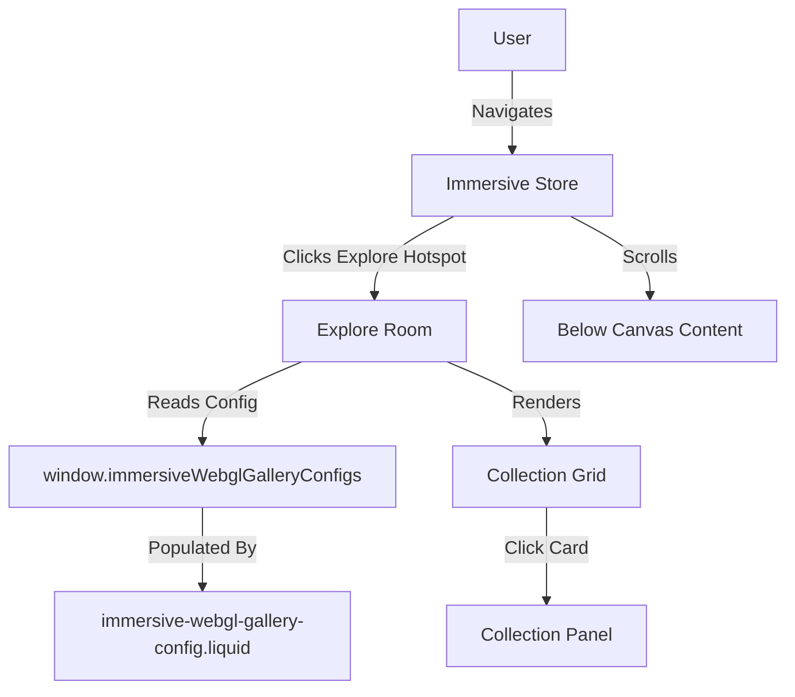
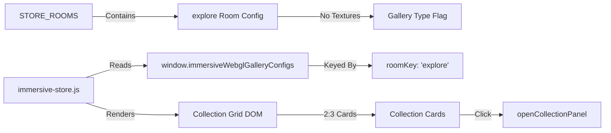

# Design Document: Explore Room and Canvas Fix

## Overview

This feature adds a new "Explore" room to the immersive 3D store that displays a scrollable grid of collection cards in a 2:3 portrait aspect ratio. Unlike traditional rooms that use parallax background textures, the Explore room showcases collection images as the primary visual content on a dark background, creating a museum gallery aesthetic.

Additionally, this feature resolves the canvas blocking issue that prevents users from scrolling to content below the immersive canvas by refactoring the CSS positioning from `fixed` to `relative`.

### Key Components

1. **Explore Room Configuration**: Add "explore" room to STORE_ROOMS with gallery-specific properties
2. **Gallery Rendering System**: Read collection data from `window.immersiveWebglGalleryConfigs` and render as a responsive grid
3. **Lounge Hotspot**: Add navigation hotspot in the Lounge room to access Explore
4. **Canvas Wrapper Refactoring**: Change positioning to allow natural page scrolling
5. **Scroll Performance Optimization**: Use Intersection Observer to pause rendering when canvas is out of viewport

### Design Principles

- **Data-Driven**: Gallery content is configured via the existing `immersive-webgl-gallery-config.liquid` section
- **Performance-First**: Lazy load images, pause rendering when out of viewport, use CSS transforms for GPU acceleration
- **Accessibility**: Full keyboard navigation, ARIA labels, screen reader announcements
- **Responsive**: Adaptive grid layout (5-6 columns desktop, 3-4 tablet, 2 mobile)
- **Minimal Visual Complexity**: No background textures in Explore room—collections are the environment

## Architecture

### System Context



### Component Architecture



### Data Flow

1. **Configuration Phase** (Page Load):
   - `immersive-webgl-gallery-config.liquid` section renders with `room_key="explore"`
   - JavaScript in section populates `window.immersiveWebglGalleryConfigs['explore']` with collection data
   - Each item includes: `imageSrc`, `title`, `subtitle`, `collectionHandle`, `productHandle`

2. **Room Entry Phase** (User Navigates to Explore):
   - User clicks "Explore" hotspot in Lounge
   - `navigateToRoom('explore')` is called
   - System detects room has no `baseTextureUrl` (gallery type)
   - System calls `renderGalleryRoom('explore')`

3. **Rendering Phase**:
   - Read `window.immersiveWebglGalleryConfigs['explore']`
   - Generate grid HTML with collection cards
   - Inject into `#ui-layer` or dedicated gallery container
   - Apply CSS Grid layout with 2:3 aspect ratio cards
   - Lazy load images using Intersection Observer

4. **Interaction Phase**:
   - User clicks collection card
   - Extract `collectionHandle` from card's data attribute
   - Call `openCollectionPanel(collectionHandle)`
   - Existing panel system displays collection details

## Components and Interfaces

### 1. STORE_ROOMS Configuration

**Location**: `assets/immersive-store.js`

**New Room Entry**:
```javascript
explore: {
  // No baseTextureUrl or depthMapUrl - this is a gallery room
  isGalleryRoom: true,  // Flag to indicate special rendering
  hotspots: [
    { 
      x: 50, 
      y: 90, 
      label: 'Back to Lounge', 
      targetRoom: 'lounge',
      mobileX: 50,
      mobileY: 90
    }
  ]
}
```

**Properties**:
- `isGalleryRoom` (boolean): Indicates this room uses DOM-based gallery rendering instead of WebGL textures
- `hotspots` (array): Contains navigation hotspots (back to lounge)
- No `baseTextureUrl`, `depthMapUrl`, `mobileBaseTextureUrl`, `mobileDepthMapUrl`

### 2. Lounge Hotspot Addition

**Location**: `assets/immersive-store.js` → `STORE_ROOMS.lounge.hotspots`

**New Hotspot**:
```javascript
{ 
  x: 50, 
  y: 50, 
  label: 'Explore', 
  targetRoom: 'explore',
  mobileX: 50,
  mobileY: 50
}
```

**Positioning**: Center of the Lounge room (can be adjusted based on visual design)

### 3. Gallery Rendering System

**Location**: `assets/immersive-store.js`

**New Function**: `renderGalleryRoom(roomKey)`

**Responsibilities**:
1. Read collection data from `window.immersiveWebglGalleryConfigs[roomKey]`
2. Generate HTML for collection grid
3. Inject into DOM (within `#ui-layer` or new container)
4. Set up lazy loading for images
5. Attach click handlers to collection cards
6. Apply responsive CSS Grid layout

**Pseudocode**:
```javascript
function renderGalleryRoom(roomKey) {
  const galleryData = window.immersiveWebglGalleryConfigs[roomKey];
  if (!galleryData || !galleryData.length) {
    showEmptyGalleryMessage();
    return;
  }

  const gridHTML = galleryData.map(item => `
    <div class="collection-card" 
         data-collection-handle="${item.collectionHandle}"
         data-index="${item.index}">
      
      <div class="collection-card__title">${item.title}</div>
    </div>
  `).join('');

  const container = document.getElementById('gallery-container') || createGalleryContainer();
  container.innerHTML = `<div class="collection-grid">${gridHTML}</div>`;
  
  setupLazyLoading(container);
  attachCardClickHandlers(container);
}
```

### 4. Collection Card Component

**HTML Structure**:
```html
<div class="collection-card" data-collection-handle="summer-collection">
  <div class="collection-card__image-wrapper">
    
  </div>
  <div class="collection-card__title">Summer Collection</div>
</div>
```

**CSS Requirements**:
- 2:3 portrait aspect ratio (e.g., 300px × 450px)
- Hover effects: subtle scale (1.02) and glow
- Responsive sizing based on grid columns
- Dark border or shadow for separation from background

**Aspect Ratio Implementation**:
```css
.collection-card__image-wrapper {
  aspect-ratio: 2 / 3;
  overflow: hidden;
  position: relative;
}

.collection-card__img {
  width: 100%;
  height: 100%;
  object-fit: cover;
}
```

### 5. Collection Grid Layout

**CSS Grid Configuration**:
```css
.collection-grid {
  display: grid;
  gap: 1.5rem;
  padding: 2rem;
  background: #050509;
  min-height: 100vh;
}

/* Desktop: 5-6 columns */
@media (min-width: 1024px) {
  .collection-grid {
    grid-template-columns: repeat(auto-fill, minmax(250px, 1fr));
  }
}

/* Tablet: 3-4 columns */
@media (min-width: 768px) and (max-width: 1023px) {
  .collection-grid {
    grid-template-columns: repeat(auto-fill, minmax(200px, 1fr));
  }
}

/* Mobile: 2 columns */
@media (max-width: 767px) {
  .collection-grid {
    grid-template-columns: repeat(2, 1fr);
    gap: 1rem;
    padding: 1rem;
  }
}
```

### 6. Canvas Wrapper CSS Refactoring

**Location**: `sections/immersive-canvas.liquid` → ``

**Current CSS** (Problematic):
```css
.immersive-store__canvas-wrapper {
  position: fixed;
  inset: 0;
  width: 100%;
  height: 100vh;
  overflow: hidden;
  background: #000;
}
```

**New CSS** (Allows Scrolling):
```css
.immersive-store__canvas-wrapper {
  position: relative;
  width: 100%;
  height: 100vh;  /* Keep initial viewport height */
  background: #000;
  /* Remove overflow: hidden to allow scrolling */
}
```

**Key Changes**:
1. `position: fixed` → `position: relative`
2. Remove `overflow: hidden`
3. Remove `inset: 0` (not needed for relative positioning)
4. Keep `height: 100vh` to maintain initial canvas size

### 7. Scroll Performance Optimization

**Intersection Observer Setup**:
```javascript
function setupCanvasScrollOptimization() {
  const canvas = document.getElementById('immersive-canvas');
  const canvasWrapper = canvas.closest('.immersive-store__canvas-wrapper');
  
  const observer = new IntersectionObserver((entries) => {
    entries.forEach(entry => {
      if (entry.isIntersecting) {
        // Canvas is in viewport - resume rendering
        immersiveState.canvasVisible = true;
        resumeRendering();
      } else {
        // Canvas is out of viewport - pause rendering
        immersiveState.canvasVisible = false;
        pauseRendering();
      }
    });
  }, {
    threshold: [0, 0.1, 0.5, 0.9, 1.0]  // Track visibility percentage
  });
  
  observer.observe(canvasWrapper);
}
```

**Rendering Control**:
```javascript
function animate() {
  if (!immersiveState.canvasVisible) {
    // Reduce render frequency when out of viewport
    setTimeout(() => requestAnimationFrame(animate), 1000);  // 1fps
    return;
  }
  
  // Normal rendering when visible
  requestAnimationFrame(animate);
  renderScene();
}
```

### 8. Room Navigation Integration

**Modified Function**: `navigateToRoom(roomKey)`

**Logic Addition**:
```javascript
function navigateToRoom(roomKey) {
  const roomConfig = STORE_ROOMS[roomKey];
  
  if (!roomConfig) {
    console.error('Room not found:', roomKey);
    return;
  }
  
  // Check if this is a gallery room
  if (roomConfig.isGalleryRoom) {
    renderGalleryRoom(roomKey);
    hideCanvas();  // Hide WebGL canvas for gallery rooms
  } else {
    showCanvas();  // Show WebGL canvas for texture-based rooms
    loadRoomTextures(roomKey);
  }
  
  updateRoomBadge(roomKey);
  updateNavigationHistory(roomKey);
}
```

### 9. Lazy Loading Implementation

**Intersection Observer for Images**:
```javascript
function setupLazyLoading(container) {
  const images = container.querySelectorAll('img[data-src]');
  
  const imageObserver = new IntersectionObserver((entries) => {
    entries.forEach(entry => {
      if (entry.isIntersecting) {
        const img = entry.target;
        img.src = img.dataset.src;
        img.removeAttribute('data-src');
        imageObserver.unobserve(img);
      }
    });
  }, {
    rootMargin: '50px'  // Start loading 50px before entering viewport
  });
  
  images.forEach(img => imageObserver.observe(img));
}
```

### 10. Collection Card Click Handler

**Function**: `attachCardClickHandlers(container)`

```javascript
function attachCardClickHandlers(container) {
  const cards = container.querySelectorAll('.collection-card');
  
  cards.forEach(card => {
    card.addEventListener('click', () => {
      const collectionHandle = card.dataset.collectionHandle;
      openCollectionPanel(collectionHandle);
      
      // Analytics tracking
      trackEvent('explore_room_collection_click', {
        collection: collectionHandle,
        room: 'explore'
      });
    });
    
    // Keyboard accessibility
    card.setAttribute('tabindex', '0');
    card.setAttribute('role', 'button');
    card.addEventListener('keydown', (e) => {
      if (e.key === 'Enter' || e.key === ' ') {
        e.preventDefault();
        card.click();
      }
    });
  });
}
```

## Data Models

### Gallery Config Item

**Source**: `window.immersiveWebglGalleryConfigs[roomKey]`

**Structure**:
```typescript
interface GalleryItem {
  index: number;                    // Sequential index (0-based)
  room: string;                     // Room key (e.g., 'explore')
  title: string;                    // Collection title
  subtitle: string;                 // Optional subtitle
  productHandle: string | null;     // Linked product handle
  productId: string | null;         // Linked product ID
  collectionHandle: string | null;  // Linked collection handle
  imageSrc: string | null;          // Image URL
  imageWidth: number | null;        // Image width
  imageHeight: number | null;       // Image height
}
```

### Room Configuration

**Source**: `STORE_ROOMS[roomKey]`

**Structure**:
```typescript
interface RoomConfig {
  baseTextureUrl?: string;          // Desktop base texture (optional for gallery rooms)
  mobileBaseTextureUrl?: string;    // Mobile base texture (optional)
  depthMapUrl?: string;             // Desktop depth map (optional)
  mobileDepthMapUrl?: string;       // Mobile depth map (optional)
  isGalleryRoom?: boolean;          // Flag for gallery-type rooms
  hotspots: Hotspot[];              // Navigation hotspots
}

interface Hotspot {
  x: number;                        // X position (percentage)
  y: number;                        // Y position (percentage)
  mobileX?: number;                 // Mobile X position
  mobileY?: number;                 // Mobile Y position
  label: string;                    // Hotspot label
  targetRoom?: string;              // Target room key
  targetCollection?: string;        // Target collection handle
  targetEditorialRoom?: string;     // Target editorial room
}
```

### Immersive State Extension

**Location**: `immersiveState` object in `assets/immersive-store.js`

**New Properties**:
```javascript
immersiveState.canvasVisible = true;      // Is canvas in viewport?
immersiveState.currentRoomType = 'texture';  // 'texture' | 'gallery'
immersiveState.galleryScrollPosition = 0;    // Track scroll position in gallery
```

## Error Handling

### 1. Missing Gallery Config

**Scenario**: `window.immersiveWebglGalleryConfigs[roomKey]` is undefined or empty

**Handling**:
```javascript
function renderGalleryRoom(roomKey) {
  const galleryData = window.immersiveWebglGalleryConfigs?.[roomKey];
  
  if (!galleryData || !Array.isArray(galleryData) || galleryData.length === 0) {
    showEmptyGalleryMessage(roomKey);
    console.warn(`No gallery data found for room: ${roomKey}`);
    return;
  }
  
  // Proceed with rendering
}

function showEmptyGalleryMessage(roomKey) {
  const container = getGalleryContainer();
  container.innerHTML = `
    <div class="gallery-empty-state">
      <p>No collections available in this gallery.</p>
      <button onclick="navigateToRoom('lounge')">Return to Lounge</button>
    </div>
  `;
}
```

### 2. Image Load Failures

**Scenario**: Collection card image fails to load

**Handling**:
```javascript
function setupImageErrorHandling(container) {
  const images = container.querySelectorAll('.collection-card__img');
  
  images.forEach(img => {
    img.addEventListener('error', () => {
      // Replace with placeholder
      img.src = 'data:image/svg+xml,...';  // SVG placeholder
      img.classList.add('collection-card__img--error');
      
      console.warn('Failed to load image:', img.dataset.src);
    });
  });
}
```

### 3. Room Navigation Errors

**Scenario**: User attempts to navigate to non-existent room

**Handling**:
```javascript
function navigateToRoom(roomKey) {
  if (!STORE_ROOMS[roomKey]) {
    console.error(`Room "${roomKey}" does not exist`);
    showToast('Unable to navigate to room', 'error');
    return;
  }
  
  // Proceed with navigation
}
```

### 4. Intersection Observer Not Supported

**Scenario**: Browser doesn't support Intersection Observer API

**Handling**:
```javascript
function setupCanvasScrollOptimization() {
  if (!('IntersectionObserver' in window)) {
    console.warn('IntersectionObserver not supported - canvas will always render');
    immersiveState.canvasVisible = true;
    return;
  }
  
  // Setup observer
}
```

### 5. Collection Panel Load Errors

**Scenario**: Collection data fails to load when card is clicked

**Handling**:
```javascript
function openCollectionPanel(collectionHandle) {
  showPanelLoader();
  
  fetchCollectionData(collectionHandle)
    .then(data => {
      renderCollectionPanel(data);
    })
    .catch(error => {
      console.error('Failed to load collection:', error);
      showPanelError('Unable to load collection. Please try again.');
      
      // Track error for monitoring
      trackEvent('collection_panel_error', {
        collection: collectionHandle,
        error: error.message
      });
    });
}
```

## Testing Strategy

### Unit Tests

**Test Framework**: Jest or Vitest (JavaScript unit testing)

**Test Cases**:

1. **STORE_ROOMS Configuration**:
   - Verify `explore` room exists in STORE_ROOMS
   - Verify `explore` room has `isGalleryRoom: true`
   - Verify `explore` room has no texture URLs
   - Verify `explore` room has hotspots array

2. **Lounge Hotspot**:
   - Verify Lounge has "Explore" hotspot
   - Verify hotspot has correct `targetRoom: 'explore'`
   - Verify hotspot has x, y, mobileX, mobileY coordinates

3. **Gallery Rendering**:
   - Test `renderGalleryRoom()` with valid data
   - Test `renderGalleryRoom()` with empty data
   - Test `renderGalleryRoom()` with missing config
   - Verify correct HTML structure is generated
   - Verify collection cards have correct data attributes

4. **Lazy Loading**:
   - Test `setupLazyLoading()` creates Intersection Observer
   - Test images load when entering viewport
   - Test images don't load when out of viewport

5. **Click Handlers**:
   - Test collection card click opens panel
   - Test keyboard navigation (Enter/Space)
   - Test analytics tracking on click

6. **Canvas Visibility**:
   - Test Intersection Observer detects canvas visibility
   - Test rendering pauses when canvas out of viewport
   - Test rendering resumes when canvas enters viewport

### Integration Tests

**Test Framework**: Playwright or Cypress (E2E testing)

**Test Cases**:

1. **Navigation Flow**:
   - Navigate from Storefront → Lounge → Explore
   - Verify Explore room displays collection grid
   - Navigate back to Lounge from Explore
   - Verify back button works correctly

2. **Gallery Display**:
   - Verify collection cards render with correct images
   - Verify 2:3 aspect ratio is maintained
   - Verify responsive grid layout (desktop, tablet, mobile)
   - Verify lazy loading works (images load on scroll)

3. **Collection Panel**:
   - Click collection card
   - Verify collection panel opens
   - Verify collection details display correctly
   - Close panel and verify Explore room is still visible

4. **Canvas Scrolling**:
   - Verify canvas is visible on page load
   - Scroll down past canvas
   - Verify below-canvas content is accessible
   - Scroll back up
   - Verify canvas is still functional

5. **Performance**:
   - Measure scroll performance (should maintain 30fps minimum)
   - Verify rendering pauses when canvas out of viewport
   - Measure time to first collection card render (<1s)

### Accessibility Tests

**Test Framework**: axe-core, WAVE, manual testing

**Test Cases**:

1. **Keyboard Navigation**:
   - Tab through collection cards
   - Verify focus indicators are visible
   - Press Enter/Space to open collection panel
   - Verify focus management when panel opens/closes

2. **Screen Reader**:
   - Verify room name is announced when entering Explore
   - Verify collection count is announced
   - Verify collection card labels are read correctly
   - Verify ARIA labels are present and accurate

3. **ARIA Attributes**:
   - Verify `role="button"` on collection cards
   - Verify `aria-label` on interactive elements
   - Verify `aria-live` regions for dynamic content

### Visual Regression Tests

**Test Framework**: Percy, Chromatic, or BackstopJS

**Test Cases**:

1. **Explore Room Layout**:
   - Desktop view (1920×1080)
   - Tablet view (768×1024)
   - Mobile view (375×667)

2. **Collection Card Styling**:
   - Default state
   - Hover state
   - Focus state
   - Error state (image failed to load)

3. **Canvas Wrapper**:
   - Canvas visible in viewport
   - Canvas partially scrolled out
   - Canvas completely out of viewport

### Performance Tests

**Test Framework**: Lighthouse, WebPageTest

**Metrics**:

1. **Load Performance**:
   - Time to first collection card render: <1s
   - Largest Contentful Paint (LCP): <2.5s
   - First Input Delay (FID): <100ms

2. **Scroll Performance**:
   - Maintain 60fps on desktop during scroll
   - Maintain 30fps on mobile during scroll
   - No layout thrashing (batch DOM reads/writes)

3. **Memory Usage**:
   - No memory leaks when navigating between rooms
   - Proper cleanup of Intersection Observers
   - Proper cleanup of event listeners

### Browser Compatibility Tests

**Browsers**:
- Chrome (latest 2 versions)
- Firefox (latest 2 versions)
- Safari (latest 2 versions)
- Edge (latest 2 versions)
- Mobile Safari (iOS 14+)
- Chrome Mobile (Android 10+)

**Test Cases**:
- Verify Intersection Observer support (or graceful degradation)
- Verify CSS Grid layout works correctly
- Verify aspect-ratio CSS property works (or fallback)
- Verify lazy loading works across browsers

## Implementation Plan

### Phase 1: Core Configuration (1-2 hours)

1. Add `explore` room to STORE_ROOMS
2. Add "Explore" hotspot to Lounge
3. Test navigation from Lounge to Explore (should show empty room)

### Phase 2: Gallery Rendering (3-4 hours)

1. Implement `renderGalleryRoom()` function
2. Implement collection card HTML generation
3. Implement CSS Grid layout with responsive breakpoints
4. Implement 2:3 aspect ratio styling
5. Test with sample data from `window.immersiveWebglGalleryConfigs`

### Phase 3: Lazy Loading & Interactions (2-3 hours)

1. Implement Intersection Observer for lazy loading
2. Implement collection card click handlers
3. Integrate with existing `openCollectionPanel()` function
4. Implement keyboard navigation
5. Add ARIA labels and accessibility attributes

### Phase 4: Canvas Wrapper Refactoring (2-3 hours)

1. Update CSS in `sections/immersive-canvas.liquid`
2. Change `position: fixed` to `position: relative`
3. Remove `overflow: hidden`
4. Test scrolling to below-canvas content
5. Verify existing rooms still work correctly

### Phase 5: Scroll Performance Optimization (2-3 hours)

1. Implement Intersection Observer for canvas visibility
2. Implement rendering pause/resume logic
3. Test scroll performance with DevTools Performance panel
4. Optimize if needed (throttle, debounce, requestAnimationFrame)

### Phase 6: Error Handling & Edge Cases (1-2 hours)

1. Handle missing gallery config
2. Handle image load failures
3. Handle browser compatibility (Intersection Observer polyfill)
4. Add error messages and fallbacks

### Phase 7: Testing & QA (3-4 hours)

1. Write unit tests for core functions
2. Write integration tests for navigation flow
3. Perform accessibility audit
4. Perform cross-browser testing
5. Perform performance testing

### Phase 8: Documentation & Deployment (1 hour)

1. Update code comments
2. Update README or developer documentation
3. Deploy to staging environment
4. Final QA on staging
5. Deploy to production

**Total Estimated Time**: 15-22 hours

## Deployment Considerations

### Rollout Strategy

1. **Feature Flag**: Consider adding a feature flag to enable/disable Explore room
2. **Staged Rollout**: Deploy to staging first, then production
3. **Monitoring**: Set up error tracking for gallery rendering failures
4. **Analytics**: Track Explore room usage, collection clicks, time spent

### Rollback Plan

1. **Quick Rollback**: Remove "Explore" hotspot from Lounge (users can't access)
2. **Full Rollback**: Revert all changes to `immersive-store.js` and `immersive-canvas.liquid`
3. **Partial Rollback**: Keep canvas fix, remove Explore room

### Performance Monitoring

1. **Metrics to Track**:
   - Explore room entry rate
   - Collection card click rate
   - Average time spent in Explore room
   - Image load failure rate
   - Scroll performance (fps)

2. **Error Tracking**:
   - Gallery config missing errors
   - Image load failures
   - Collection panel load failures
   - Browser compatibility issues

### Browser Support

**Minimum Requirements**:
- CSS Grid support (all modern browsers)
- Intersection Observer support (or polyfill for older browsers)
- ES6 JavaScript support

**Polyfills Needed**:
- Intersection Observer polyfill for IE11 (if supporting IE11)
- CSS aspect-ratio polyfill for older browsers

### Accessibility Compliance

**WCAG 2.1 Level AA Requirements**:
- Keyboard navigation (Success Criterion 2.1.1)
- Focus visible (Success Criterion 2.4.7)
- Labels or instructions (Success Criterion 3.3.2)
- Name, role, value (Success Criterion 4.1.2)

**Testing**:
- Manual keyboard navigation testing
- Screen reader testing (NVDA, JAWS, VoiceOver)
- Automated accessibility testing (axe-core)

## Future Enhancements

### Phase 2 Features (Post-Launch)

1. **Search & Filter**:
   - Add search bar to filter collections by name
   - Add filter by designer, occasion, price range
   - Add sort options (newest, popular, price)

2. **Infinite Scroll**:
   - Load more collections as user scrolls
   - Implement virtual scrolling for large collections

3. **Collection Previews**:
   - Show product count on hover
   - Show price range on hover
   - Show "New" or "Sale" badges

4. **Animations**:
   - Stagger animation for collection cards on entry
   - Smooth transitions between rooms
   - Parallax effect on collection cards

5. **Personalization**:
   - Show "Recommended for You" section
   - Show "Recently Viewed" collections
   - Show "Based on Your Saves" collections

6. **Analytics Dashboard**:
   - Track most viewed collections
   - Track conversion rate from Explore room
   - A/B test different grid layouts

## Conclusion

This design provides a comprehensive blueprint for implementing the Explore room and canvas fix. The architecture is modular, performance-optimized, and accessible. The implementation plan is broken into manageable phases with clear deliverables and time estimates.

The key technical decisions are:

1. **Gallery Room Type**: Use `isGalleryRoom` flag to distinguish from texture-based rooms
2. **Data Source**: Leverage existing `immersive-webgl-gallery-config.liquid` section
3. **Rendering**: DOM-based grid rendering (not WebGL) for simplicity and accessibility
4. **Performance**: Intersection Observer for lazy loading and rendering optimization
5. **Accessibility**: Full keyboard navigation and ARIA support from day one

The canvas fix is straightforward: change `position: fixed` to `position: relative` and remove `overflow: hidden`. This allows natural page scrolling while maintaining canvas functionality.
