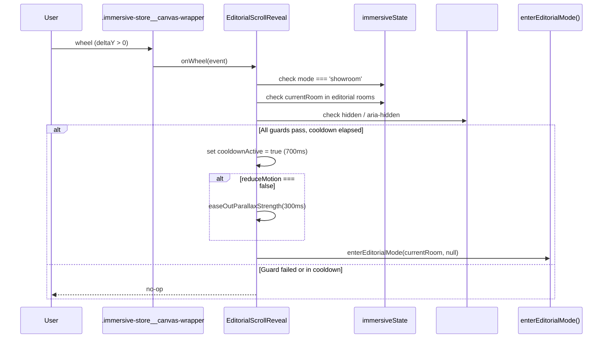
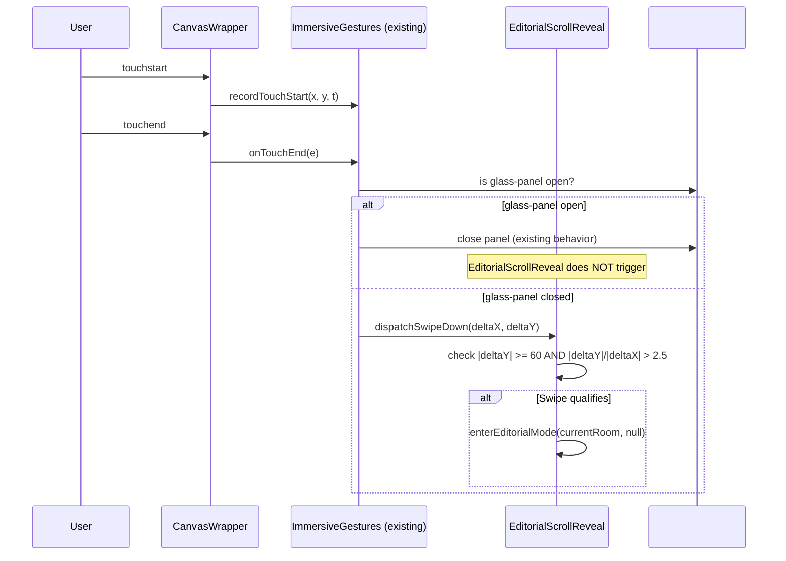
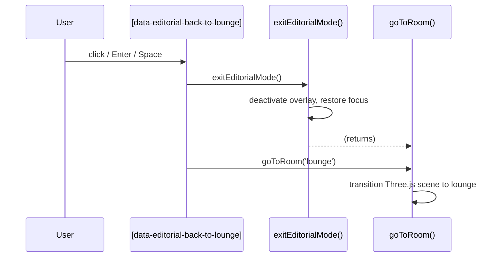

# Design Document: Immersive Editorial Enhancements

## Overview

This design covers six progressive-enhancement modules for the Shahana Collection 3D immersive store at `/pages/immersive`. The modules deepen the editorial experience without breaking the Three.js canvas or any existing overlay system.

All new JavaScript lives in `assets/immersive-store.js`. Global, page-scoped CSS goes in `assets/immersive-theme.css`. Card-scoped CSS stays in the `` block of `snippets/immersive-product-card.liquid`. The only new Liquid change needed is a small addition to the overlay shell in `sections/immersive-canvas.liquid` for the Back to Lounge button.

### Modules

| Module | Purpose | Key files touched |
|--------|---------|-------------------|
| EditorialScrollReveal | Scroll/wheel on canvas triggers `enterEditorialMode()` | `immersive-store.js` |
| EditorialBackToLounge | Persistent chip inside overlay returns to lounge | `immersive-canvas.liquid`, `immersive-store.js`, `immersive-theme.css` |
| VisitedRoomsIndicator | `.is-visited` on room picker buttons from `_browsingContext` | `immersive-store.js`, `immersive-theme.css` |
| EditorialHeroParallax | `translateY` on hero-bg driven by overlay scroll | `immersive-store.js`, `immersive-theme.css` |
| ProductCardTilt | CSS perspective tilt on product card mousemove | `immersive-store.js`, `immersive-product-card.liquid` |
| CustomerJourneyDocument | docs/customer-journey.md | `docs/customer-journey.md` |

---

## Architecture

The immersive store has three rendering layers:

```
┌─────────────────────────────────────────────────────┐
│  Layer 3 — DOM Overlays (dialogs, bottom nav, etc.) │
│  #immersive-editorial-overlay  #glass-panel  etc.   │
├─────────────────────────────────────────────────────┤
│  Layer 2 — DOM UI Layer  (#ui-layer)                │
│  Hotspots, labels, header, onboarding               │
├─────────────────────────────────────────────────────┤
│  Layer 1 — WebGL Canvas  (#immersive-canvas)        │
│  Three.js rooms, depth maps, pointer parallax       │
└─────────────────────────────────────────────────────┘
```

All new modules attach to existing entry points in `immersive-store.js`:

- **EditorialScrollReveal** — initialised by a new `initEditorialScrollReveal()` call inside `safeBindImmersiveInit()`, after `initImmersiveGestures()`.
- **EditorialBackToLounge** — button rendered by `immersive-canvas.liquid`; wired in a new `initEditorialBackToLounge()` called inside `safeBindImmersiveInit()`.
- **VisitedRoomsIndicator** — `syncVisitedRooms()` called from the existing `trackRoomVisit()` function and from the room picker open handler in `initImmersiveBottomNav()`.
- **EditorialHeroParallax** — `initEditorialHeroParallax()` called at the end of `enterEditorialMode()`; `destroyEditorialHeroParallax()` called at the start of `exitEditorialMode()`.
- **ProductCardTilt** — `initProductCardTilt()` called once inside `safeBindImmersiveInit()`, delegated to the collection panel container `#glass-panel`.

### Integration points in `immersive-store.js`

```
safeBindImmersiveInit()
  ├── initImmersiveScene()
  ├── bindImmersiveNav()
  ├── setupImageParallax()
  ├── initImmersiveGestures()        ← existing
  ├── initEditorialScrollReveal()    ← NEW
  ├── initEditorialBackToLounge()    ← NEW
  ├── initProductCardTilt()          ← NEW
  ├── showImmersiveOnboardingIfNeeded()
  ├── initWishlist()
  └── bindCookieBanner()

enterEditorialMode(roomKey, triggerEl)
  ├── (existing logic)
  └── initEditorialHeroParallax()    ← NEW — appended

exitEditorialMode()
  ├── destroyEditorialHeroParallax() ← NEW — prepended
  └── (existing logic)

trackRoomVisit(roomKey)
  ├── _browsingContext.visitedRooms.push(roomKey)
  └── syncVisitedRooms()             ← NEW — appended

initImmersiveBottomNav() — room picker open handler
  └── syncVisitedRooms()             ← NEW — called before hidden=false
```

---

## Sequence Diagrams

### EditorialScrollReveal — wheel (desktop)



### EditorialScrollReveal — swipe (mobile)



### EditorialBackToLounge



---

## Components and Interfaces

### 1. EditorialScrollReveal

```javascript
// State (module-private globals in immersive-store.js)
var _esrCooldown = false;          // 700ms lock after trigger
var _esrWheelBound = false;        // guard double-bind
var _esrTouchBound = false;

// Public init (called once from safeBindImmersiveInit)
function initEditorialScrollReveal();

// Internal helpers
function _esrOnWheel(event);       // wheel handler
function _esrOnSwipeDown(deltaX, deltaY); // called from gesture dispatcher
function _esrTrigger();            // shared trigger path
function _esrEaseOutParallax(durationMs, callback); // lerp parallaxStrength→0
```

**Guard conditions evaluated by `_esrTrigger()`:**

| Condition | Value required | Source |
|-----------|---------------|--------|
| `immersiveState.mode` | `'showroom'` | `immersiveState` |
| `immersiveState.currentRoom` | One of `designer_houses`, `occasions`, `featured_collections` | `immersiveState` |
| `#glass-panel` open | `false` | `panel.classList.contains('is-active')` |
| Cooldown | `false` | `_esrCooldown` |

**Parallax ease-out:** When `reduceMotion === false`, `parallaxStrength` is tweened from its current value to `0` over 300 ms using `requestAnimationFrame` with a linear decay. On completion, `enterEditorialMode()` is called. When `reduceMotion === true`, `enterEditorialMode()` fires synchronously.

**Canvas wrapper target:** `document.querySelector('.immersive-store__canvas-wrapper')` — consistent with existing toast/loader attachment pattern.

---

### 2. EditorialBackToLounge

**DOM (added to `sections/immersive-canvas.liquid` overlay shell):**

```html
<div class="immersive-editorial-overlay__header-actions">
  <!-- existing close button (#immersive-editorial-back) stays first -->
  <button
    type="button"
    class="immersive-editorial__back-to-lounge immersive-chip"
    data-editorial-back-to-lounge
    hidden
  >
    <!-- label populated from data-back-to-lounge-label on overlay shell, or fallback -->
  </button>
</div>
```

The overlay shell (`#immersive-editorial-overlay`) gets a new data attribute:

```html
data-back-to-lounge-label="{{ 'sections.immersive_editorial.back_to_lounge' | t | escape }}"
```

**JS interface:**

```javascript
function initEditorialBackToLounge();
// Called once from safeBindImmersiveInit.
// Reads data-back-to-lounge-label from overlay shell.
// Wires click on [data-editorial-back-to-lounge].
// Exposes updateBackToLoungeVisibility(roomKey) — called at start of enterEditorialMode.
```

**Visibility rule:** Button is `hidden` when `roomKey === 'lounge'`; otherwise visible. The attribute `hidden` is toggled by `updateBackToLoungeVisibility()`, called at the end of `enterEditorialMode()` after setting `immersiveState.editorialRoom`.

**Focus order invariant:** The button is inserted *after* the existing `#immersive-editorial-back` close button in DOM order, guaranteeing the close button remains the first focusable element (Req 2.6).

---

### 3. VisitedRoomsIndicator

```javascript
// Excluded rooms — navigation hubs, not editorial destinations
var VISITED_ROOMS_EXCLUDE = ['lounge', 'storefront'];

function syncVisitedRooms();
// Reads _browsingContext.visitedRooms.
// For each [data-room-key] button in [data-bottom-nav-room-picker]:
//   - add .is-visited and set data-visited-label if key in visited AND not excluded
//   - remove .is-visited and data-visited-label otherwise
// Safe when visitedRooms is empty or undefined.
```

**`data-visited-label` value source:** `[data-bottom-nav-room-picker]` receives a new data attribute:

```html
data-room-visited-label="{{ 'sections.immersive_store.room_visited' | t | escape }}"
```

JS reads this once during init and writes it to each visited button's `aria-description` attribute.

**Call sites:**
1. `trackRoomVisit(roomKey)` — after `_browsingContext.visitedRooms.push(roomKey)`.
2. `initImmersiveBottomNav()` rooms button click handler — before `roomPicker.hidden = false`.

---

### 4. EditorialHeroParallax

```javascript
// Module state (module-private)
var _ehpScrollTarget = 0;   // raw scrollTop * 0.3, clamped
var _ehpScrollCurrent = 0;  // lerped value
var _ehpRafId = null;        // requestAnimationFrame handle
var _ehpOverlay = null;      // cached overlay reference
var _ehpHeroImg = null;      // cached .immersive-editorial__hero-bg reference

function initEditorialHeroParallax();
// Called at END of enterEditorialMode(), after overlay is activated.
// Guards reduceMotion. Caches overlay and hero-bg. Attaches scroll listener.
// Starts rAF loop.

function destroyEditorialHeroParallax();
// Called at START of exitEditorialMode(), before UI deactivation.
// Removes scroll listener. Cancels rAF. Resets transform. Nulls refs.

function _ehpOnScroll();
// Updates _ehpScrollTarget = clamp(overlay.scrollTop * 0.3, 0, 60).

function _ehpLoop();
// _ehpScrollCurrent += (_ehpScrollTarget - _ehpScrollCurrent) * 0.08
// heroImg.style.transform = 'translateY(' + _ehpScrollCurrent + 'px)'
// _ehpRafId = requestAnimationFrame(_ehpLoop)
```

**CSS in `assets/immersive-theme.css`:**

```css
.immersive-editorial__hero-bg {
  will-change: transform;
}
/* Reset for reduced motion */
@media (prefers-reduced-motion: reduce) {
  .immersive-editorial__hero-bg {
    will-change: auto;
    transform: none !important;
  }
}
```

The hero element already has `overflow: hidden`, so the parallax image cannot overflow visually.

---

### 5. ProductCardTilt

```javascript
// Module state
var _pctRafPending = false;
var _pctActiveCard = null;
var _pctRotateX = 0;
var _pctRotateY = 0;

function initProductCardTilt();
// Guards window.matchMedia('(pointer: fine)').matches — exits if false.
// Guards reduceMotion — exits if true.
// Attaches one mousemove + mouseleave listener on #glass-panel (event delegation).

function _pctOnMouseMove(event);
// Finds closest .immersive-product-card from event.target.
// Reads card.getBoundingClientRect().
// Computes normX, normY (clamped to [-1, 1]).
// If !_pctRafPending: schedules rAF, sets _pctRafPending = true.

function _pctApplyTilt(card, normX, normY);
// rotateY = normX * 8
// rotateX = -normY * 8
// card.style.transform = 'perspective(600px) rotateX(' + rotateX + 'deg) rotateY(' + rotateY + 'deg)'

function _pctOnMouseLeave(event);
// Resets _pctActiveCard.style.transform = ''
// (CSS transition handles the ease-out)
```

**Keyboard focus guard:** The `mousemove` handler checks `document.activeElement === card || card.contains(document.activeElement)` and skips tilt if the card is keyboard-focused.

**CSS additions to `` in `snippets/immersive-product-card.liquid`:**

```css
.immersive-product-card {
  transform-style: preserve-3d;
  /* transition already set to 'transform 0.3s ease' — add mouseleave reset speed */
}

/* Explicit mouseleave reset transition */
.immersive-product-card.tilt-reset {
  transition: transform 400ms ease-out, box-shadow 0.3s ease, border-color 0.3s ease;
}

@media (prefers-reduced-motion: reduce) {
  .immersive-product-card {
    perspective: none !important;
    transform-style: flat !important;
  }
}
```

The JS toggles `.tilt-reset` class on `mouseleave` (and removes it on the next `mousemove`) to apply the 400 ms ease-out only during the reset, not during live tracking.

---

## Data Models

### `immersiveState` (existing, relevant fields)

```javascript
var immersiveState = {
  mode: 'showroom',        // 'showroom' | 'editorial'
  currentRoom: 'lounge',   // room key string
  editorialRoom: null,     // room key or null
  lastHotspot: null,       // HTMLElement | null
};
```

### `_browsingContext` (existing, relevant fields)

```javascript
var _browsingContext = {
  visitedRooms: [],        // string[] — room keys visited this session
  savedProducts: [],
  viewedCollections: [],
};
```

### EditorialScrollReveal state (new module-private)

```javascript
{
  _esrCooldown: boolean,          // true during 700ms lockout
  _esrWheelBound: boolean,        // init guard
  _esrTouchBound: boolean,        // init guard
}
```

### EditorialHeroParallax state (new module-private)

```javascript
{
  _ehpScrollTarget: number,       // computed target (0–60px)
  _ehpScrollCurrent: number,      // lerped current position
  _ehpRafId: number | null,       // rAF handle for cancellation
  _ehpOverlay: HTMLElement | null,
  _ehpHeroImg: HTMLElement | null,
}
```

### ProductCardTilt state (new module-private)

```javascript
{
  _pctRafPending: boolean,
  _pctActiveCard: HTMLElement | null,
  _pctPendingNormX: number,
  _pctPendingNormY: number,
}
```

---

## File Change Map

| File | Change type | Reason |
|------|-------------|--------|
| `assets/immersive-store.js` | Add JS | All 5 new modules (EditorialScrollReveal, EditorialBackToLounge, VisitedRoomsIndicator, EditorialHeroParallax, ProductCardTilt) |
| `assets/immersive-theme.css` | Add CSS | `.is-visited` indicator styles; `.immersive-editorial__back-to-lounge` chip positional styles; `will-change: transform` + reduced-motion reset on `.immersive-editorial__hero-bg` |
| `sections/immersive-canvas.liquid` | Add HTML + data attrs | Back to Lounge button inside overlay shell; `data-back-to-lounge-label` on overlay; `data-room-visited-label` on room picker |
| `snippets/immersive-product-card.liquid` | Add CSS in `` | `transform-style: preserve-3d`; `.tilt-reset` class; reduced-motion override |
| `locales/en.default.json` | Add keys | `sections.immersive_editorial.back_to_lounge`; `sections.immersive_store.room_visited` |
| `docs/customer-journey.md` | Create | CustomerJourneyDocument (Req 6) |

---

## CSS Approach

### `assets/immersive-theme.css` — global immersive styles

These go here because they apply page-wide, not to a single section or snippet:

```css
/* ── VisitedRoomsIndicator ───────────────────────────────── */
.immersive-bottom-nav__room-option.is-visited {
  border-color: rgba(212, 175, 55, 0.5);
  position: relative;
}

.immersive-bottom-nav__room-option.is-visited::after {
  content: '✓';
  position: absolute;
  top: 50%;
  right: 1rem;
  transform: translateY(-50%);
  color: #d4af37;
  font-size: 0.875rem;
  font-weight: 700;
}

/* ── EditorialBackToLounge ───────────────────────────────── */
.immersive-editorial-overlay__header-actions {
  display: flex;
  align-items: center;
  gap: 0.75rem;
  /* sits alongside the existing close button */
}

/* ── EditorialHeroParallax ───────────────────────────────── */
.immersive-editorial__hero-bg {
  will-change: transform;
}

@media (prefers-reduced-motion: reduce) {
  .immersive-editorial__hero-bg {
    will-change: auto;
    transform: none !important;
    transition: none !important;
  }
}
```

### `snippets/immersive-product-card.liquid` `` block — card-scoped

```css
/* ProductCardTilt additions */
.immersive-product-card {
  /* add to existing rule */
  transform-style: preserve-3d;
}

.immersive-product-card.tilt-reset {
  transition: transform 400ms ease-out, box-shadow 0.3s ease, border-color 0.3s ease;
}

@media (prefers-reduced-motion: reduce) {
  .immersive-product-card {
    perspective: none !important;
    transform-style: flat !important;
    transform: none !important;
  }
}
```

---

## Correctness Properties

*A property is a characteristic or behavior that should hold true across all valid executions of a system — essentially, a formal statement about what the system should do. Properties serve as the bridge between human-readable specifications and machine-verifiable correctness guarantees.*

### Property 1: Scroll intent guard — only enters editorial for correct state

*For any* combination of `(mode, currentRoom, glassPanelOpen)`, calling the scroll-reveal trigger should call `enterEditorialMode` if and only if `mode === 'showroom'` AND `currentRoom` is one of `['designer_houses', 'occasions', 'featured_collections']` AND `glassPanelOpen === false`.

**Validates: Requirements 1.2, 1.3, 1.4**

### Property 2: Wheel detection threshold

*For any* wheel event `deltaY`, the scroll-reveal module detects scroll intent if and only if `deltaY > 0`.

**Validates: Requirements 1.7**

### Property 3: Mobile swipe detection threshold

*For any* touch gesture with `(deltaX, deltaY)`, a downward swipe is detected if and only if `Math.abs(deltaY) >= 60` AND `(deltaX === 0 OR Math.abs(deltaY) / Math.abs(deltaX) > 2.5)`.

**Validates: Requirements 1.8**

### Property 4: 700ms cooldown — trigger fires at most once per burst

*For any* sequence of N scroll-intent events fired within a 700ms window, `enterEditorialMode` is called at most once.

**Validates: Requirements 1.10**

### Property 5: Back to Lounge always calls exitEditorialMode then goToRoom('lounge')

*For any* editorial overlay state (any `roomKey`, any content), activating the Back to Lounge button always results in `exitEditorialMode()` being called before `goToRoom('lounge')`, and always in that order.

**Validates: Requirements 2.2**

### Property 6: Back to Lounge button persists after content injection

*For any* arbitrary HTML injected into `#immersive-editorial-overlay-content`, the button `[data-editorial-back-to-lounge]` still exists inside `#immersive-editorial-overlay` after injection.

**Validates: Requirements 2.8**

### Property 7: VisitedRoomsIndicator applies .is-visited exactly to non-excluded visited rooms

*For any* array of `visitedRooms` (including empty, undefined, or containing lounge/storefront), after `syncVisitedRooms()` runs:
- every `[data-room-key]` button whose key is in `visitedRooms` AND is not `'lounge'` or `'storefront'` has `.is-visited`
- every other button does NOT have `.is-visited`
- no error is thrown

**Validates: Requirements 3.1, 3.4, 3.7**

### Property 8: Visited buttons receive aria-description

*For any* `visitedRooms` array, every button that receives `.is-visited` also has its `aria-description` attribute set to a non-empty string.

**Validates: Requirements 3.6**

### Property 9: Hero parallax clamp

*For any* `scrollTop` value (including negative, zero, or very large), the computed `translateY` value satisfies `0 <= translateY <= 60`.

**Validates: Requirements 4.1, 4.2**

### Property 10: Product card tilt within bounds

*For any* `(cursorX, cursorY)` position within or outside a card's bounding rect, the computed `rotateX` and `rotateY` values are always within `[-8, 8]` degrees.

**Validates: Requirements 5.1, 5.2, 5.3**

---

## Error Handling

| Scenario | Handling |
|----------|----------|
| Canvas wrapper not found (`initEditorialScrollReveal`) | Early return, no listeners attached, no error thrown |
| `enterEditorialMode` called while `_esrCooldown` is active | Silently ignored (cooldown guard) |
| `#immersive-editorial-overlay` not in DOM (`initEditorialBackToLounge`) | Early return; no button wired |
| `[data-editorial-back-to-lounge]` not found after SRA injection | `initEditorialBackToLounge` is called once; button is in the overlay shell, not in SRA content — no re-wiring needed |
| `_browsingContext.visitedRooms` is `undefined` (`syncVisitedRooms`) | Treated as empty array via `(visitedRooms \|\| [])` guard |
| `[data-bottom-nav-room-picker]` not in DOM (`syncVisitedRooms`) | Early return after `querySelectorAll` returns empty NodeList |
| `.immersive-editorial__hero-bg` not found (`initEditorialHeroParallax`) | `destroyEditorialHeroParallax()` called, no rAF loop started |
| `exitEditorialMode()` called when `_ehpRafId` is null | `cancelAnimationFrame(null)` is a no-op; safe |
| ProductCardTilt: `getBoundingClientRect()` returns zero-width/height | Division by zero guarded by `if (rect.width === 0 \|\| rect.height === 0) return` |
| ProductCardTilt on non-pointer:fine device | `window.matchMedia('(pointer: fine)').matches` checked at init; if false, function returns immediately, no listeners bound |
| `pointer: fine` media query unsupported | `window.matchMedia` returns object with `matches: false`; treated as non-pointer:fine |

---

## Testing Strategy

### Dual approach

Property-based tests verify universal invariants across hundreds of random inputs. Unit/example tests cover specific scenarios, edge cases, and integration wiring.

### Test files

| File | Type | Covers |
|------|------|--------|
| `tests/editorial-scroll-reveal.property.test.js` | PBT + unit | Properties 1–4; example tests for cooldown, reduceMotion path, swipe exclusion |
| `tests/editorial-back-to-lounge.property.test.js` | PBT + unit | Properties 5–6; unit tests for visibility, focus order, keyboard activation |
| `tests/visited-rooms-indicator.property.test.js` | PBT + unit | Properties 7–8; unit tests for sync timing, picker-open wiring |
| `tests/editorial-hero-parallax.property.test.js` | PBT + unit | Property 9; unit tests for listener cleanup, reduceMotion guard |
| `tests/product-card-tilt.property.test.js` | PBT + unit | Property 10; unit tests for pointer:fine guard, delegation, keyboard focus guard |

### Property test configuration

- Library: `fast-check` (already a project dependency)
- Minimum iterations: `numRuns: 100` per property assertion
- Tag format in test files: `// Feature: immersive-editorial-enhancements, Property N: <property text>`

### Unit test focus areas

- `initEditorialScrollReveal` attaches listeners in correct state; does not attach when `_esrWheelBound` is already `true`
- `_esrEaseOutParallax` sets `parallaxStrength` to 0; `enterEditorialMode` called after it resolves
- `updateBackToLoungeVisibility('lounge')` hides button; other keys show button
- Focus order: close button is first focusable element in overlay, back-to-lounge is second
- `syncVisitedRooms()` called before `roomPicker.hidden = false` in bottom nav wiring
- `initEditorialHeroParallax` does not attach listener when `reduceMotion === true`
- `destroyEditorialHeroParallax` cancels rAF and removes scroll listener (spy on `removeEventListener`)
- `initProductCardTilt` does not bind when `matchMedia('pointer: fine').matches === false`
- Keyboard-focused card: dispatch `mousemove` event while `document.activeElement === card` — verify `card.style.transform` unchanged

### Reduced motion coverage

All five modules have explicit `reduceMotion` guards. Each is covered by a dedicated unit test with `window.matchMedia` mocked to return `matches: true`.

### Accessibility regression checks

- Back to Lounge button has `type="button"` (prevents accidental form submission)
- Back to Lounge keyboard activation tested for `keydown` Enter and Space
- Visited room buttons tested for non-empty `aria-description` after `syncVisitedRooms()`
- ProductCardTilt: verify `transform` not applied when card is `:focus-visible`
