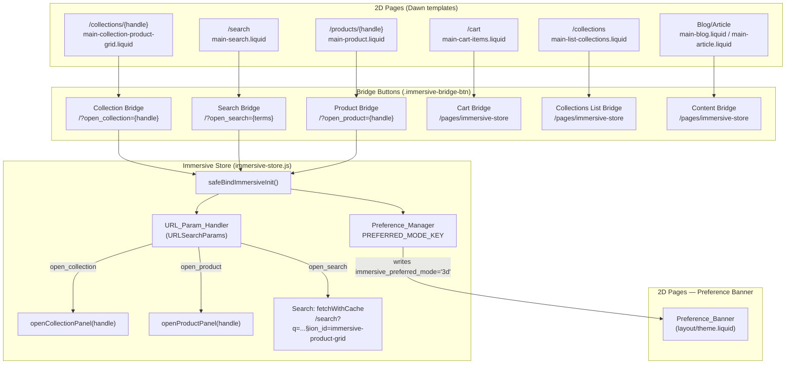

# Design Document: Immersive Journey Bridges

## Overview

The Immersive Journey Bridges feature connects the remaining "2D islands" of the Shahana Collection storefront back into the WebGL showroom. Six bridge types are introduced as progressive enhancements on top of standard Dawn templates: Collection Bridge, Search Bridge, Product Bridge, Cart Bridge, Collections List Bridge, and Content Bridges (blog/article). A 3D Mode Preference system remembers returning visitors and surfaces a re-entry prompt on 2D pages.

All bridges are standard `<a>` elements rendered by Liquid — they work without JavaScript. The URL parameter handler in `immersive-store.js` intercepts the deep-link parameters on the immersive side and opens the appropriate panel.

### Design Goals

- Zero regression on existing Dawn templates — bridges are purely additive
- Single shared CSS class (`.immersive-bridge-btn`) for consistent styling across all six bridge locations
- Reuse existing `fetchWithCache`, `openCollectionPanel`, `openProductPanel`, and `shopRoot` patterns
- All strings localised under `sections.immersive_journey_bridges` in `locales/en.default.json`
- `localStorage` access always wrapped in `try/catch`

---

## Architecture



### Key Architectural Decisions

**Single CSS class, multiple locations.** `.immersive-bridge-btn` is defined once in `assets/immersive-theme.css`. This file is already conditionally loaded on `page.immersive` and `index` templates. For 2D pages (where the bridge buttons actually appear), the class must also be available — the CSS is therefore moved to a separate small stylesheet or inlined via a `` block in a shared snippet. The chosen approach is a dedicated `snippets/immersive-bridge-btn.liquid` snippet that renders the anchor and includes a `` block, so the styles are scoped and loaded only when the snippet is rendered.

**URL parameter priority.** `open_product` takes precedence over `open_collection` which takes precedence over `open_search`. This mirrors the existing single-param pattern and avoids ambiguous states.

**Search rendering reuse.** The `immersive-product-grid` section already renders a product grid from a collection. When used for search, the Section Rendering API call targets `/search?q={query}&section_id=immersive-product-grid`. The section renders whatever products Shopify returns for that search query — no new section file is needed.

**Preference Banner placement.** The banner HTML is injected into `layout/theme.liquid` inside a `` block that excludes `page.immersive`, `index`, and `password` templates. It is rendered `hidden` in HTML; a small inline `<script>` reads `localStorage` and reveals it. This avoids flash-of-banner for users without the preference set.

---

## Components and Interfaces

### 1. `snippets/immersive-bridge-btn.liquid` — Bridge Banner Component

A reusable, rich component that renders a bridge CTA with optional image preview, heading, subtext, and device/connection awareness. All six bridge locations render this snippet with different parameters.

**Parameters (via `render` tag):**
| Parameter | Type | Description |
|---|---|---|
| `bridge_url` | String | The full href value (e.g. `/?open_collection=suffuse`) |
| `bridge_label` | String | Already-translated CTA label text |
| `bridge_aria` | String | Already-translated aria-label text |
| `bridge_class` | String | Optional extra CSS modifier class (e.g. `--home`, `--back`) |
| `bridge_heading` | String | Optional override heading (defaults to `shop.name`) |
| `bridge_subtext` | String | Optional override subtext line |
| `bridge_image` | Object | Optional Shopify image object for the preview thumbnail |

**Rendered HTML Structure:**
```html
<a
  href="/?open_collection=suffuse"
  class="immersive-bridge-banner immersive-bridge-banner--collection"
  aria-label="Explore Suffuse in the 3D Store"
  data-immersive-bridge
>
  <!-- Media section (image or placeholder) -->
  <div class="immersive-bridge-banner__media">
    
    <!-- Pulsing dot indicator -->
    <div class="immersive-bridge-banner__dot"></div>
  </div>

  <!-- Content section -->
  <div class="immersive-bridge-banner__content">
    <div class="immersive-bridge-banner__eyebrow">
      {{ 'sections.immersive_journey_bridges.bridge_eyebrow' | t }}
    </div>
    <h3 class="immersive-bridge-banner__heading">
      {{ bridge_heading | default: shop.name }}
    </h3>
    
      <p class="immersive-bridge-banner__subtext">{{ bridge_subtext }}</p>
    
    <span class="immersive-bridge-banner__cta">
      {{ bridge_label | escape }}
      <svg class="immersive-bridge-banner__arrow" ...><!-- arrow icon --></svg>
    </span>
  </div>
</a>
```

**Image Handling:**
- WHEN `bridge_image` is provided and not blank: render using Shopify's `image_url` and `image_tag` filters with responsive widths (`160, 240, 320`) and lazy loading (`loading="lazy"`).
- WHEN `bridge_image` is blank or not provided: render a placeholder SVG with the brand accent color (`#d4af37`) and geometric iconography (e.g. a stylized 3D cube or room icon).

**CSS Scoping:**
- BEM naming: `.immersive-bridge-banner`, `.immersive-bridge-banner__media`, `.immersive-bridge-banner__content`, `.immersive-bridge-banner__heading`, `.immersive-bridge-banner__cta`, `.immersive-bridge-banner__dot`, `.immersive-bridge-banner__arrow`
- Modifier classes: `.immersive-bridge-banner--collection`, `.immersive-bridge-banner--search`, `.immersive-bridge-banner--product`, `.immersive-bridge-banner--cart`, `.immersive-bridge-banner--home`, `.immersive-bridge-banner--back`
- CSS included via `` block (deduplicated by Shopify)

**Styling Details:**
- **Layout**: Flexbox row on desktop (image left, content right); stack vertically on mobile (`@media (max-width: 749px)`)
- **Border & Shadow**: `border: 1px solid rgba(212, 175, 55, 0.3)`, `box-shadow: 0 4px 12px rgba(0, 0, 0, 0.08)`
- **Hover States**: 
  - Border brightens to `#d4af37`
  - Box-shadow increases to `0 8px 24px rgba(0, 0, 0, 0.12)`
  - Arrow animates with `translateX(3px)` over 200ms
  - Transitions use `transition-property: border-color, box-shadow, transform; transition-duration: 200ms; transition-timing-function: ease-out`
- **Focus Visible**: `outline: 2px solid #d4af37; outline-offset: 3px`
- **Pulsing Dot Animation**: `.immersive-bridge-banner__dot` cycles opacity and scale over 2.4 seconds (keyframes: `0% { opacity: 1; transform: scale(1); }`, `50% { opacity: 0.6; transform: scale(1.2); }`, `100% { opacity: 1; transform: scale(1); }`)
- **Reduced Motion**: `@media (prefers-reduced-motion: reduce)` removes all transitions and animations; dot remains static at `opacity: 1; transform: scale(1)`

**Responsive Breakpoints:**
- Desktop (≥750px): Image 320px wide, content beside it, full width ~600px
- Tablet (400–749px): Image 240px wide, content beside it, full width ~90vw
- Mobile (<400px): Image 160px wide, content beside it, full width ~90vw

**Data Attributes:**
- `data-immersive-bridge`: Enables client-side device/connection-aware behavior hooks (see Requirement 16)
- `data-bridge-type`: Optional, set to `'collection'`, `'search'`, `'product'`, `'cart'`, `'content'` for JS targeting
- `data-slow-connection-warning`: Optional, populated by JS if slow connection detected (see Requirement 16)

**Snippet includes a `` block** containing all `.immersive-bridge-banner` styles. Shopify deduplicates `` output, so rendering the snippet multiple times on one page emits the CSS only once.

### 2. Bridge Button Placement — Per Section

#### `sections/main-collection-product-grid.liquid` — Collection Bridge

Inserted **above** the `<div class="section-{{ section.id }}-padding ...">` wrapper (i.e. outside `#ProductGridContainer`) so facet filter re-renders do not remove it.

```liquid

  <div class="page-width immersive-bridge-banner__wrapper">
    
  </div>

```

#### `sections/main-search.liquid` — Search Bridge

Inserted inside `.template-search__header`, after the results count `<p>` tag, outside `#ProductGridContainer`.

```liquid

  

```

#### `sections/main-product.liquid` — Product Bridge

Replaces the existing hardcoded block at lines ~430–434. Inserted after the `buy_buttons` block case, still inside `ProductInfo-{{ section.id }}`.

```liquid

  {# ... existing buy buttons block ... #}
  <div style="margin-top: 1rem; width: 100%;">
    
  </div>
```

#### `sections/main-cart-items.liquid` — Cart Bridge

Inserted inside the `<div class="page-width">` wrapper, after the `<div class="title-wrapper-with-link">` heading block, conditional on `cart.item_count > 0`.

```liquid

  

```

#### `sections/main-list-collections.liquid` — Collections List Bridge

Inserted inside `<div class="page-width">`, after the `<h1>` title, before the `` block.

```liquid
<div class="immersive-bridge-banner__wrapper">
  
</div>
```

#### `sections/main-blog.liquid` and `sections/main-article.liquid` — Content Bridges

In `main-blog.liquid`: inserted inside `.main-blog.page-width`, after the `<h1>` blog title.

In `main-article.liquid`: inserted inside the `article.article-template`, after the last block loop, before the back-to-blog link.

```liquid

```

### 3. URL Parameter Handler Extension (`assets/immersive-store.js`)

The existing `try` block inside `safeBindImmersiveInit` is extended to handle all three parameters with explicit priority ordering:

```javascript
try {
  if (window.URLSearchParams) {
    var params = new URLSearchParams(window.location.search);
    var openProduct = params.get('open_product');
    var openCollection = params.get('open_collection');
    var openSearch = params.get('open_search');

    if (openProduct) {
      // Priority 1: product (existing behaviour, unchanged)
      setTimeout(function () {
        openProductPanel(openProduct);
      }, 400);
    } else if (openCollection) {
      // Priority 2: collection
      setTimeout(function () {
        openCollectionPanel(openCollection);
      }, 400);
    } else if (openSearch) {
      // Priority 3: search
      setTimeout(function () {
        openSearchPanel(openSearch);
      }, 400);
    }
  }
} catch (e) {}
```

### 4. `openSearchPanel(encodedQuery)` — New Function

Added to `immersive-store.js`. Decodes the query, constructs the Section Rendering URL, and renders into the glass panel using the same pattern as `openCollectionPanel`.

```javascript
function openSearchPanel(encodedQuery) {
  var query = '';
  try { query = decodeURIComponent(encodedQuery); } catch (e) { query = encodedQuery; }
  if (!query) return;

  var panel = document.getElementById(glassPanelId);
  if (!panel) return;

  _panelTrigger = document.activeElement;
  panel.classList.remove('hidden');
  panel.removeAttribute('hidden');

  var fetchUrl = shopRoot + 'search?q=' + encodeURIComponent(query) + '&section_id=immersive-product-grid';

  fetchWithCache(fetchUrl)
    .then(function (html) {
      if (!html) { showErrorFeedback(panel, panel.getAttribute('data-msg-load-collection-error') || ''); return; }
      function render() {
        var contentArea = panel.querySelector('.immersive-store__panel-content');
        if (contentArea) contentArea.innerHTML = html;
        panel.setAttribute('data-open', 'true');
        openDialogFocus(panel, _panelTrigger);
        setupVariantButtons(panel);
        setupImageParallax(panel);
        syncAllWishlistToggles(panel);
        trackImmersiveEvent('search_panel_opened', { query: query });
      }
      transitionPanelContent(panel, render);
    })
    .catch(function (err) {
      console.error('[Immersive] Search panel fetch failed:', err);
      showErrorFeedback(panel, panel.getAttribute('data-msg-load-collection-error') || '');
    });
}
```

### 5. Preference Manager (`assets/immersive-store.js`)

**Constant added** alongside existing keys:

```javascript
var PREFERRED_MODE_KEY = 'immersive_preferred_mode';
```

**Write function** — called at the end of `initImmersiveScene()` after the scene is confirmed ready (after `hideLoader()` is called):

```javascript
function writeImmersivePreference() {
  try {
    localStorage.setItem(PREFERRED_MODE_KEY, '3d');
  } catch (e) {}
}
```

**Read function** — used by the inline script in `layout/theme.liquid`:

```javascript
function readImmersivePreference() {
  try {
    return localStorage.getItem(PREFERRED_MODE_KEY) === '3d';
  } catch (e) {
    return false;
  }
}
```

`writeImmersivePreference()` is called once inside `initImmersiveScene()`, after `hideLoader()`:

```javascript
// Inside initImmersiveScene(), after hideLoader():
writeImmersivePreference();
```

### 7. Device/Connection-Aware Bridge Behavior (`assets/bridge-behavior.js`)

A new centralized script (separate from `immersive-store.js`) that detects device constraints and modifies bridge UI accordingly. This script runs on all pages (2D and 3D) and is loaded in `layout/theme.liquid`.

**Initialization:**
```javascript
function initBridgeBehavior() {
  var bridges = document.querySelectorAll('[data-immersive-bridge]');
  if (!bridges.length) return;

  var isSlowConnection = detectSlowConnection();
  var hasReducedMotion = window.matchMedia('(prefers-reduced-motion: reduce)').matches;

  bridges.forEach(function (bridge) {
    if (isSlowConnection || hasReducedMotion) {
      applyConstraintWarning(bridge, isSlowConnection, hasReducedMotion);
    }
  });
}

document.readyState === 'loading'
  ? document.addEventListener('DOMContentLoaded', initBridgeBehavior)
  : initBridgeBehavior();
```

**Connection Detection:**
```javascript
function detectSlowConnection() {
  // Feature detection guard
  if (!navigator.connection) return false;

  var conn = navigator.connection;
  var saveData = conn.saveData || false;
  var effectiveType = conn.effectiveType || '';

  return saveData || ['slow-2g', '2g', '3g'].indexOf(effectiveType) !== -1;
}
```

**Constraint Warning Application:**
```javascript
function applyConstraintWarning(bridge, isSlowConnection, hasReducedMotion) {
  // Only apply warning to bridges pointing to 3D store
  var href = bridge.getAttribute('href') || '';
  var is3DLink = href.indexOf('/pages/immersive-store') !== -1 || href.indexOf('?open_') !== -1;
  if (!is3DLink) return;

  // Modify heading text with warning message
  var heading = bridge.querySelector('.immersive-bridge-banner__heading');
  if (heading && isSlowConnection) {
    var warningMsg = bridge.getAttribute('data-slow-connection-warning') || 'Optimized for faster connections';
    heading.textContent = warningMsg;
    bridge.classList.add('immersive-bridge-banner--slow-connection');
  }

  // Reduce opacity if motion sensitivity is high
  if (hasReducedMotion) {
    bridge.classList.add('immersive-bridge-banner--reduced-motion');
  }
}
```

**CSS Modifiers (in `immersive-bridge-banner` stylesheet):**
```css
.immersive-bridge-banner--slow-connection {
  opacity: 0.85;
  border-color: rgba(212, 175, 55, 0.2);
}

.immersive-bridge-banner--slow-connection .immersive-bridge-banner__heading {
  font-size: 0.95em;
  color: #666;
}

.immersive-bridge-banner--reduced-motion .immersive-bridge-banner__dot {
  animation: none;
  opacity: 1;
  transform: scale(1);
}

.immersive-bridge-banner--reduced-motion {
  transition: none;
}
```

**Localization:**
- `data-slow-connection-warning` attribute is populated by Liquid with the localized string from `sections.immersive_journey_bridges.slow_connection_warning` (e.g. "3D store is heavier on slower connections")
- No hard-coded English text in JavaScript

**Feature Detection:**
- All `navigator.connection` checks are wrapped in feature detection guards
- Browsers without Network Information API support gracefully skip connection detection
- Motion sensitivity detection via `window.matchMedia` is universally supported

**HTML structure** — injected inside `<body>`, after the skip-to-content link, inside a template guard:

```liquid

  <div
    id="immersive-preference-banner"
    class="immersive-preference-banner"
    role="region"
    aria-label="{{ 'sections.immersive_journey_bridges.preference_banner_aria' | t }}"
    hidden
  >
    <p class="immersive-preference-banner__text">
      {{ 'sections.immersive_journey_bridges.preference_banner_text' | t }}
    </p>
    <div class="immersive-preference-banner__actions">
      <a
        href="/pages/immersive-store"
        class="immersive-preference-banner__cta"
      >
        {{ 'sections.immersive_journey_bridges.preference_banner_cta' | t }}
      </a>
      <button
        type="button"
        class="immersive-preference-banner__dismiss"
        data-preference-banner-dismiss
        aria-label="{{ 'sections.immersive_journey_bridges.preference_banner_dismiss_aria' | t }}"
      >
        {{ 'sections.immersive_journey_bridges.preference_banner_dismiss' | t }}
      </button>
    </div>
  </div>

  <script>
    (function () {
      try {
        if (localStorage.getItem('immersive_preferred_mode') === '3d') {
          var banner = document.getElementById('immersive-preference-banner');
          if (banner) {
            banner.removeAttribute('hidden');
            var dismissBtn = banner.querySelector('[data-preference-banner-dismiss]');
            if (dismissBtn) {
              dismissBtn.addEventListener('click', function () {
                var next = banner.nextElementSibling;
                banner.remove();
                if (next && next.focus) next.focus();
              });
            }
          }
        }
      } catch (e) {}
    })();
  </script>

```

**Focus management on dismiss:** after `banner.remove()`, focus moves to `banner.nextElementSibling` (the skip-to-content link or the header). This satisfies Requirement 9.2 without requiring knowledge of the full DOM tree.

---

## Data Models

### localStorage Keys

| Key | Value | Owner | Notes |
|---|---|---|---|
| `immersive_preferred_mode` | `'3d'` | Preference_Manager | New. Written on `initImmersiveScene` success. |
| `immersive_onboarding_seen` | `'true'` | Existing | Unchanged. |
| `immersive_wishlist` | JSON array | Existing | Unchanged. |
| `immersive_cookie_notice` | `'accepted'`/`'declined'` | Existing | Unchanged. |

`PREFERRED_MODE_KEY = 'immersive_preferred_mode'` is defined as a `var` constant alongside `ONBOARDING_KEY` and `WISHLIST_KEY`.

### URL Parameter Schema

| Parameter | Source | Handler | Priority |
|---|---|---|---|
| `open_product` | Product Bridge | `openProductPanel(handle)` | 1 (highest) |
| `open_collection` | Collection Bridge | `openCollectionPanel(handle)` | 2 |
| `open_search` | Search Bridge | `openSearchPanel(encodedQuery)` | 3 |

### Localisation Keys (`sections.immersive_journey_bridges`)

```json
"immersive_journey_bridges": {
  "bridge_eyebrow": "Explore in 3D",
  "collection_cta": "Explore in 3D Store",
  "collection_cta_aria": "Explore {{ title }} in the 3D Store",
  "search_cta": "View results in 3D Store",
  "search_cta_aria": "View results for {{ terms }} in the 3D Store",
  "search_heading": "Search: {{ terms }}",
  "product_cta": "Experience in 3D Store",
  "product_cta_aria": "Experience {{ title }} in the 3D Store",
  "cart_cta": "Return to 3D Browsing",
  "cart_heading": "Continue Shopping in 3D",
  "collections_list_cta": "Explore in 3D Store",
  "collections_list_cta_aria": "Explore all collections in the 3D Store",
  "collections_heading": "Explore Collections in 3D",
  "content_cta": "Explore the 3D Store",
  "content_cta_aria": "Explore the Shahana Collection 3D Store",
  "content_heading": "Discover in 3D",
  "slow_connection_warning": "3D store is optimized for faster connections",
  "preference_banner_text": "Welcome back — your 3D store is ready.",
  "preference_banner_cta": "Return to 3D Store",
  "preference_banner_dismiss": "Dismiss",
  "preference_banner_dismiss_aria": "Dismiss the 3D store prompt",
  "preference_banner_aria": "3D store preference prompt"
}
```

---

## Correctness Properties

*A property is a characteristic or behavior that should hold true across all valid executions of a system — essentially, a formal statement about what the system should do. Properties serve as the bridge between human-readable specifications and machine-verifiable correctness guarantees.*

### Property Reflection

Before writing properties, redundancy is eliminated:

- 1.1 (collection URL construction) and 11.1 (product URL construction) and 3.1 (search URL construction) all test the same pattern: `/?open_{type}={value}`. These can be unified into a single **bridge URL construction** property that covers all three handle-based bridges.
- 2.1 (open_collection parsing) and 2.4/12.4 (priority: open_product beats open_collection) are distinct — one tests extraction, one tests priority logic. Both are kept.
- 4.3 (URL encode/decode round-trip) is a sub-property of 4.1 (search fetch URL construction). The round-trip is the more fundamental property and subsumes the fetch URL test.
- 5.1 (write '3d') and 5.3 (idempotence) can be combined: writing N times always results in '3d'.
- 5.2 (localStorage throws → no throw) and 6.5 (localStorage unavailable → banner hidden) are both error-handling properties over localStorage access. They are kept separate because they test different functions.
- 1.5 (collection aria-label contains title), 3.5 (search aria-label contains terms), 11.3 (product aria-label contains title) all test the same pattern: aria-label construction contains the dynamic value. These are unified into a single **bridge aria-label** property.

After reflection, 5 distinct properties remain.

### Property 1: Bridge URL construction is correct for all handle types

*For any* non-empty handle string (product handle, collection handle) or URL-encoded search terms string, the bridge URL constructed by the Liquid template should equal `/?open_{type}=` concatenated with the handle (or URL-encoded terms), with no extra characters or encoding applied to the handle itself.

**Validates: Requirements 1.1, 2.1, 3.1, 11.1**

### Property 2: URL parameter parser extracts the correct value for any handle

*For any* URL query string containing `open_collection={handle}` (or `open_product={handle}`), parsing it with `URLSearchParams` should return exactly `handle` — including handles containing hyphens, numbers, and URL-safe characters.

**Validates: Requirements 2.1, 2.2, 12.1, 12.2**

### Property 3: URL parameter priority — open_product always wins over open_collection

*For any* URL query string containing both `open_product` and `open_collection` parameters with non-empty values, the URL_Param_Handler dispatch result should be `'product'` and never `'collection'`.

**Validates: Requirements 2.4, 12.4**

### Property 4: Search query encode/decode round-trip is lossless

*For any* search terms string (including spaces, special characters, non-ASCII characters), URL-encoding and then URL-decoding the string should produce a value equal to the original string.

**Validates: Requirements 4.1, 4.3**

### Property 5: Preference write is idempotent and localStorage errors are swallowed

*For any* number of calls to `writeImmersivePreference()` (including zero), if `localStorage` is available, `localStorage.getItem('immersive_preferred_mode')` should equal `'3d'`. If `localStorage` throws on any call, `writeImmersivePreference()` should not propagate the exception.

**Validates: Requirements 5.1, 5.2, 5.3**

### Property 6: Preference read returns false when localStorage is unavailable

*For any* execution environment where `localStorage.getItem` throws an exception, `readImmersivePreference()` should return `false` without throwing.

**Validates: Requirements 6.5**

### Property 7: Bridge aria-label contains the dynamic context value

*For any* collection title, product title, or search terms string, the aria-label string produced by the `| t` filter with that value as a named parameter should contain the original string as a substring.

**Validates: Requirements 1.5, 3.5, 11.3**

---

## Error Handling

### Bridge Button Rendering Errors

Bridge buttons are pure Liquid — no runtime errors possible beyond missing translation keys. Missing keys fall back to the key path string (Shopify default), which is acceptable.

### URL Parameter Handler Errors

The entire URL param block is wrapped in `try/catch` (existing pattern). Individual `setTimeout` callbacks are not wrapped — `openCollectionPanel` and `openProductPanel` already have their own error handling. `openSearchPanel` follows the same pattern.

### `openSearchPanel` Errors

- Network failure: caught in `.catch()`, `showErrorFeedback` called with the existing `data-msg-load-collection-error` message (reused — search and collection errors are semantically equivalent from the user's perspective).
- Empty query after decode: early return before fetch.
- Panel element not found: early return.

### Preference Manager Errors

All `localStorage` reads and writes are wrapped in `try/catch`. Errors are silently swallowed — the preference feature is a non-critical enhancement. If `localStorage` is unavailable:
- `writeImmersivePreference()` does nothing.
- The inline banner script catches the error and the banner remains `hidden`.

### Preference Banner Dismiss Errors

The dismiss handler is a simple DOM removal. No async operations. No error handling needed beyond the outer `try/catch` in the inline script.

---

## Testing Strategy

### Unit Tests (Jest + jsdom)

Focus on specific examples and edge cases:

- **Bridge URL construction**: verify `/?open_collection=suffuse`, `/?open_product=my-product`, `/?open_search=eid+dress` produce correct href values.
- **Preference banner dismiss**: after calling the dismiss handler, the banner element is removed from the DOM and `localStorage.getItem('immersive_preferred_mode')` still returns `'3d'`.
- **`openSearchPanel` with empty string**: calling `openSearchPanel('')` should return without fetching.
- **`openSearchPanel` with decode error**: if `decodeURIComponent` throws (malformed `%`), the function falls back to the raw string.

### Property-Based Tests (Jest + fast-check)

Using `fast-check` with minimum 100 iterations per property. Each test is tagged with a comment referencing the design property.

**Property 1 — Bridge URL construction**
```javascript
// Feature: immersive-journey-bridges, Property 1: Bridge URL construction is correct for all handle types
fc.assert(fc.property(
  fc.stringMatching(/^[a-z0-9-]+$/), // valid Shopify handle
  (handle) => {
    expect(buildBridgeUrl('open_collection', handle)).toBe('/?open_collection=' + handle);
    expect(buildBridgeUrl('open_product', handle)).toBe('/?open_product=' + handle);
  }
), { numRuns: 100 });
```

**Property 2 — URL parameter extraction**
```javascript
// Feature: immersive-journey-bridges, Property 2: URL parameter parser extracts the correct value for any handle
fc.assert(fc.property(
  fc.stringMatching(/^[a-z0-9-]+$/),
  (handle) => {
    const params = new URLSearchParams('open_collection=' + handle);
    expect(params.get('open_collection')).toBe(handle);
    expect(params.get('open_collection') || null).not.toBeNull();
  }
), { numRuns: 100 });
```

**Property 3 — URL parameter priority**
```javascript
// Feature: immersive-journey-bridges, Property 3: open_product always wins over open_collection
fc.assert(fc.property(
  fc.stringMatching(/^[a-z0-9-]+$/),
  fc.stringMatching(/^[a-z0-9-]+$/),
  (productHandle, collectionHandle) => {
    const result = resolveUrlParamDispatch(
      '?open_product=' + productHandle + '&open_collection=' + collectionHandle
    );
    expect(result.type).toBe('product');
    expect(result.value).toBe(productHandle);
  }
), { numRuns: 100 });
```

**Property 4 — Search query encode/decode round-trip**
```javascript
// Feature: immersive-journey-bridges, Property 4: Search query encode/decode round-trip is lossless
fc.assert(fc.property(
  fc.string({ minLength: 1 }),
  (terms) => {
    const encoded = encodeURIComponent(terms);
    const decoded = decodeURIComponent(encoded);
    expect(decoded).toBe(terms);
  }
), { numRuns: 200 });
```

**Property 5 — Preference write idempotence and error swallowing**
```javascript
// Feature: immersive-journey-bridges, Property 5: Preference write is idempotent and localStorage errors are swallowed
fc.assert(fc.property(
  fc.integer({ min: 1, max: 10 }),
  (n) => {
    const store = {};
    const mockStorage = {
      setItem: (k, v) => { store[k] = v; },
      getItem: (k) => store[k] ?? null,
    };
    for (let i = 0; i < n; i++) writeImmersivePreference(mockStorage);
    expect(mockStorage.getItem('immersive_preferred_mode')).toBe('3d');
  }
), { numRuns: 100 });

// Error swallowing variant
fc.assert(fc.property(
  fc.integer({ min: 1, max: 5 }),
  (n) => {
    const throwingStorage = { setItem: () => { throw new Error('QuotaExceeded'); } };
    expect(() => {
      for (let i = 0; i < n; i++) writeImmersivePreference(throwingStorage);
    }).not.toThrow();
  }
), { numRuns: 100 });
```

**Property 6 — Preference read returns false on localStorage error**
```javascript
// Feature: immersive-journey-bridges, Property 6: Preference read returns false when localStorage is unavailable
fc.assert(fc.property(
  fc.anything(),
  (_) => {
    const throwingStorage = { getItem: () => { throw new Error('SecurityError'); } };
    expect(readImmersivePreference(throwingStorage)).toBe(false);
  }
), { numRuns: 100 });
```

**Property 7 — Bridge aria-label contains dynamic value**
```javascript
// Feature: immersive-journey-bridges, Property 7: Bridge aria-label contains the dynamic context value
fc.assert(fc.property(
  fc.string({ minLength: 1, maxLength: 100 }),
  (title) => {
    const ariaLabel = buildAriaLabel('collection', title);
    expect(ariaLabel).toContain(title);
  }
), { numRuns: 100 });
```

### Integration / Smoke Tests

- Verify `immersive-bridge-btn` snippet renders a valid `<a>` element with correct `href` and `aria-label` attributes.
- Verify the Preference Banner is absent from the DOM on `page.immersive` and `index` templates.
- Verify the Collection Bridge is absent when `collection.products_count == 0`.
- Verify the Search Bridge is absent when `search.results_count == 0`.
- Verify the Cart Bridge is absent when `cart.item_count == 0`.


---

## SEO and Canonical URL Integrity

### Bridge Link Discoverability

All bridge links are rendered as semantic `<a href>` elements with valid, absolute or root-relative URLs. This ensures search engine crawlers can follow them and index the immersive store as a discoverable entry point from 2D pages.

**Bridge Link Rendering:**
- Collection Bridge: `<a href="/?open_collection={{ collection.handle }}">`
- Search Bridge: `<a href="/?open_search={{ search.terms | url_encode }}">`
- Product Bridge: `<a href="/?open_product={{ product.handle }}">`
- Cart Bridge: `<a href="/pages/immersive-store">`
- Collections List Bridge: `<a href="/pages/immersive-store">`
- Content Bridge: `<a href="/pages/immersive-store">`

**Crawler Visibility:**
- Bridge links are NOT hidden via `display: none`, `visibility: hidden`, or JavaScript-only rendering
- Bridge links are NOT marked with `rel="nofollow"` or `rel="noindex"`
- Bridge links are standard navigation elements, fully discoverable by crawlers

### Query Parameter Handling

When a bridge link includes query parameters (e.g. `/?open_collection=suffuse`), the query parameter is URL-encoded and the canonical URL of the destination page remains clean.

**Canonical URL Pattern:**
- Bridge link destination: `/?open_collection=suffuse` (with query parameter)
- Canonical tag on destination page: `<link rel="canonical" href="{{ shop.url }}{{ page.url }}">`
- The canonical tag points to the clean URL without the query parameter, preventing duplicate content issues

**URL Encoding:**
- Collection handles: no encoding needed (Shopify handles are lowercase alphanumeric + hyphens)
- Search terms: URL-encoded via Liquid `| url_encode` filter to preserve spaces and special characters
- Product handles: no encoding needed (same as collection handles)

### Preference Banner Link

The Preference Banner link to `/pages/immersive-store` is a standard `<a>` element with a valid href, not a JavaScript-only navigation trigger. This ensures the link is discoverable by crawlers and functional without JavaScript.

```html
<a href="/pages/immersive-store" class="immersive-preference-banner__cta">
  {{ 'sections.immersive_journey_bridges.preference_banner_cta' | t }}
</a>
```

### Immersive Store Canonical URL

The immersive store page (`/pages/immersive-store`) maintains a self-referential canonical tag:

```liquid
<link rel="canonical" href="{{ canonical_url }}">
```

This canonical tag points to the immersive store page itself, not to any 2D page. When a user arrives via a bridge link with a query parameter (e.g. `/?open_collection=suffuse`), the canonical URL remains `/pages/immersive-store`, preventing the query parameter from being indexed as a separate page.

### Internal Linking Strategy

Bridge links serve as internal navigation pathways that:
1. Increase crawlability of the immersive store from 2D pages
2. Provide crawlers with multiple entry points to the 3D experience
3. Maintain clean canonical URLs to avoid duplicate content penalties
4. Support both user navigation and crawler discovery

This strategy aligns with SEO best practices for progressive enhancement: the immersive store is discoverable and navigable, but the canonical structure remains clean and unambiguous.
