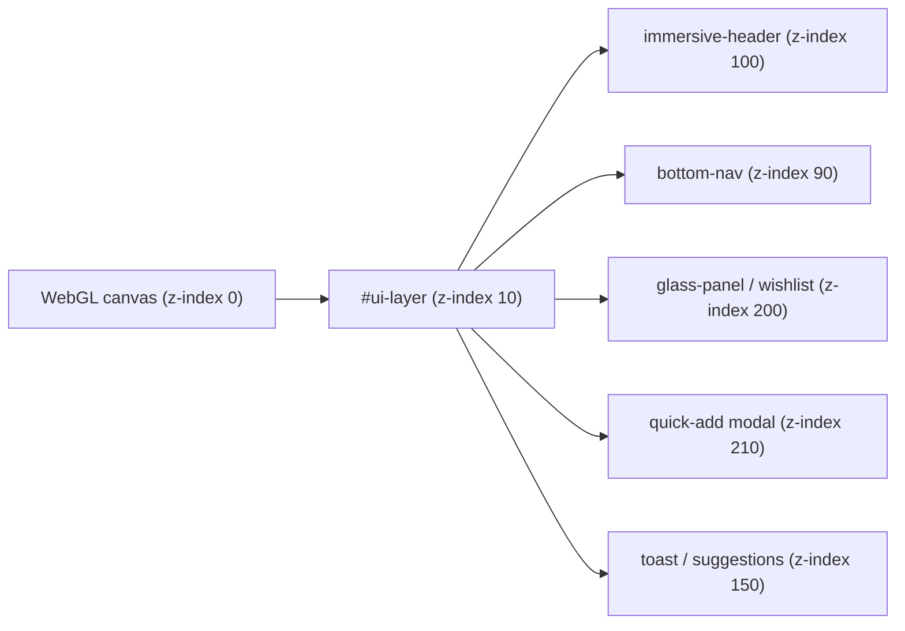
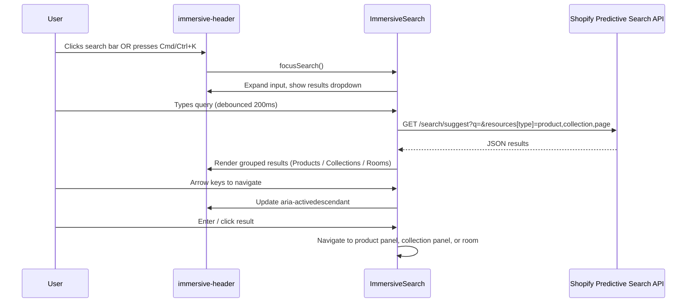
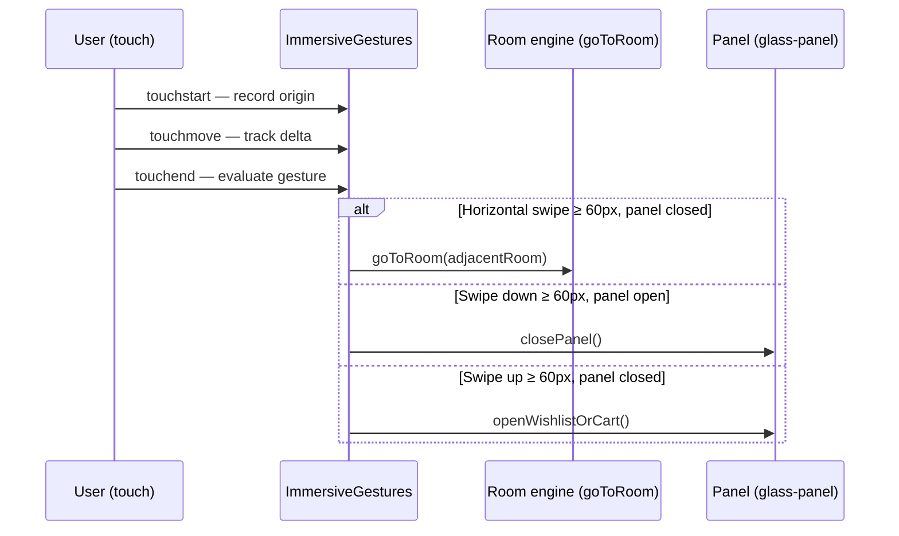
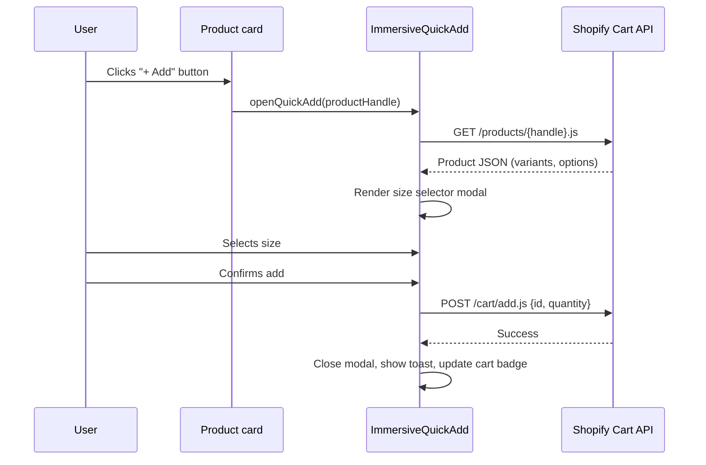

# Design Document: Immersive UX Enhancements

## Overview

This document covers eight UX improvements to the Shahana Collection immersive 3D store at `/pages/immersive`. The enhancements span navigation, search, gesture interaction, filtering, contextual suggestions, personalisation, quick commerce, and urgency signalling — all designed to deepen engagement without disrupting the WebGL parallax experience or breaking the existing Dawn/OS 2.0 architecture.

All features are implemented as progressive enhancements: the Three.js canvas and room navigation remain the source of truth for the 3D world; new UI lives in the DOM overlay layer (`#ui-layer` and the fixed `<header class="immersive-header">`). No new third-party JS libraries are introduced.

---

## Architecture

```mermaid
graph TD
    A[immersive-canvas.liquid] --> B[immersive-header]
    A --> C[#ui-layer]
    A --> D[#glass-panel]
    A --> E[#immersive-wishlist-panel]

    B --> B1[Burger menu — unchanged]
    B --> B2[Inline search bar — NEW]
    B --> B3[Account / Wishlist / Cart — unchanged]

    C --> C1[Bottom nav bar — NEW]
    C --> C2[Swipe gesture handler — NEW]
    C --> C3[Suggested next actions — NEW]
    C --> C4[Room recommendation chip — NEW]
    C --> C5[Limited-time badges — NEW]

    D --> D1[Collection panel with smart filters — ENHANCED]
    D --> D2[Quick add modal — NEW]

    F[immersive-store.js] --> F1[ImmersiveSearch module]
    F --> F2[ImmersiveBottomNav module]
    F --> F3[ImmersiveGestures module]
    F --> F4[ImmersiveFilters module]
    F --> F5[ImmersiveNextActions module]
    F --> F6[ImmersiveRoomRecommender module]
    F --> F7[ImmersiveQuickAdd module]
    F --> F8[ImmersiveLimitedTime module]
```



### Layering model



---

## Sequence Diagrams

### 1. Inline Search Flow



### 2. Swipe Gesture Flow



### 3. Quick Add Flow



---

## Components and Interfaces

### 1. Inline Search Bar (`ImmersiveSearch`)

**Purpose**: Replace the icon-only search with an always-visible inline input in the header right zone. Supports Cmd/Ctrl+K keyboard shortcut, fuzzy matching, and keyboard navigation through results.

**Interface**:
```javascript
interface ImmersiveSearch {
  init(): void
  focusSearch(): void
  blurSearch(): void
  query(term: string): Promise<SearchResults>
  renderResults(results: SearchResults): void
  navigateResults(direction: 'up' | 'down'): void
  selectResult(result: SearchResult): void
  destroy(): void
}

interface SearchResults {
  products: SearchResult[]
  collections: SearchResult[]
  rooms: RoomResult[]
}

interface SearchResult {
  type: 'product' | 'collection' | 'page'
  handle: string
  title: string
  image: string | null
  price: string | null
  url: string
}

interface RoomResult {
  type: 'room'
  roomKey: string
  label: string
}
```

**Responsibilities**:
- Render an `<input type="search">` in `.immersive-header__right`, replacing the existing `header-search` snippet render
- Bind `keydown` on `document` for Cmd/Ctrl+K → `focusSearch()`
- Debounce input at 200ms before calling Shopify Predictive Search API
- Fuzzy-match room names client-side (no API call needed for rooms)
- Render grouped dropdown: Products, Collections, Rooms
- Arrow key navigation with `aria-activedescendant` on the input
- Enter/click: products → `openProductPanel()`, collections → `openCollectionPanel()`, rooms → `goToRoom()`
- Escape: close dropdown, blur input
- All strings via `data-*` attributes on the search container (Liquid-injected)

**Liquid changes**: Replace `` in `immersive-canvas.liquid` with a new inline search markup block. Add locale keys under `sections.immersive_store.search.*`.

---

### 2. Bottom Navigation Bar (`ImmersiveBottomNav`)

**Purpose**: Persistent floating bar at the bottom of the viewport providing quick access to Editorial Rooms, Wishlist, Cart, and Back to 2D. Visible on all screen sizes; especially important on mobile where the top header is compact.

**Interface**:
```javascript
interface ImmersiveBottomNav {
  init(): void
  show(): void
  hide(): void
  updateBadges(wishlistCount: number, cartCount: number): void
  setActiveRoom(roomKey: string): void
}
```

**Responsibilities**:
- Render a `<nav class="immersive-bottom-nav">` inside `#ui-layer`
- Four items: Rooms (grid icon), Wishlist (heart icon), Cart (bag icon), 2D (monitor icon)
- Rooms item opens a room-picker sheet (list of available rooms)
- Wishlist/Cart delegate to existing `data-wishlist-open` / `#cart-toggle` handlers
- 2D item mirrors `data-mode-switch-2d` behaviour
- Floating style: `position: fixed; bottom: 1.5rem; left: 50%; transform: translateX(-50%)`
- Backdrop blur + gold border — matches existing glassmorphism aesthetic
- Badge counts synced with existing wishlist and cart badge state
- Hides when a panel is open (avoids z-index conflicts); re-shows on panel close
- `prefers-reduced-motion`: no entrance animation

**Liquid changes**: Add bottom nav shell HTML to `immersive-canvas.liquid` with all locale strings as `data-*` attributes.

---

### 3. Swipe Gestures (`ImmersiveGestures`)

**Purpose**: Touch-native room navigation and panel control. Swipe left/right to change rooms, swipe down to close open panels, swipe up to open wishlist/cart.

**Interface**:
```javascript
interface ImmersiveGestures {
  init(): void
  destroy(): void
}

interface GestureConfig {
  minSwipeDistance: number   // px, default 60
  maxSwipeTime: number       // ms, default 400
  directionLockThreshold: number  // ratio, default 2.5
}
```

**Responsibilities**:
- Listen to `touchstart`, `touchmove`, `touchend` on the canvas wrapper
- Track `startX`, `startY`, `startTime`
- On `touchend`: compute `deltaX`, `deltaY`, elapsed time
- Direction lock: if `|deltaX| / |deltaY| > 2.5` → horizontal gesture; else vertical
- Horizontal (panel closed): left swipe → next room in sequence; right swipe → previous room
- Vertical down (panel open): close panel
- Vertical up (panel closed): open wishlist panel
- Ignore gestures that start on interactive elements (buttons, links, variant pickers)
- Respect `prefers-reduced-motion`: skip room transition animation (instant switch)
- Room sequence for swipe: `storefront → lounge → designer_houses → occasions → featured_collections` (circular)

**No Liquid changes required** — pure JS module added to `immersive-store.js`.

---

### 4. Smart Filters (`ImmersiveFilters`)

**Purpose**: Color, price, and designer filters inside collection panels, applied without leaving the 3D experience. Filter state persisted per room in `sessionStorage`.

**Interface**:
```javascript
interface ImmersiveFilters {
  init(panelEl: HTMLElement, collectionHandle: string): void
  applyFilters(filters: FilterState): void
  clearFilters(): void
  saveFilters(roomKey: string, filters: FilterState): void
  loadFilters(roomKey: string): FilterState
}

interface FilterState {
  colors: string[]
  priceMin: number | null
  priceMax: number | null
  designers: string[]
  sortBy: 'manual' | 'price-asc' | 'price-desc' | 'title-asc'
}
```

**Responsibilities**:
- Inject a filter toolbar above the product grid inside `#glass-panel` when a collection is open
- Color swatches: extracted from product `color` option values in the loaded collection
- Price range: two number inputs (min/max) with PKR currency label
- Designer chips: extracted from product `vendor` values
- Sort dropdown: Manual / Price ↑ / Price ↓ / A–Z
- On filter change: re-fetch collection via Section Rendering API with `?filter.p.m.custom.color[]=&filter.v.price.gte=&sort_by=` params appended
- Persist `FilterState` to `sessionStorage` keyed by `immersive_filters_{roomKey}`
- Restore filters when re-entering the same room's collection panel
- "Clear all" resets state and re-fetches unfiltered collection
- All filter labels via locale keys `sections.immersive_store.filters.*`

**Liquid changes**: `immersive-product-grid.liquid` needs to accept and render filter params passed via Section Rendering API URL. Filter toolbar HTML injected by JS into the panel after content loads.

---

### 5. Suggested Next Actions (`ImmersiveNextActions`)

**Purpose**: Contextual action chips that appear after key user events — viewing a product, adding to cart, finishing a room — to guide the next step in the journey.

**Interface**:
```javascript
interface ImmersiveNextActions {
  init(): void
  showAfterProductView(product: ProductContext): void
  showAfterAddToCart(product: ProductContext): void
  showAfterRoomComplete(roomKey: string): void
  dismiss(): void
}

interface ProductContext {
  handle: string
  title: string
  vendor: string
  collectionHandle: string
  roomKey: string
}

interface ActionChip {
  label: string
  action: () => void
  icon: string
}
```

**Responsibilities**:
- Render a `<div class="immersive-next-actions">` toast-style bar at the bottom of the viewport (above bottom nav)
- After product view (panel open ≥ 8s or explicit close): show "Continue exploring [Room]" + "See more from [Vendor]"
- After add-to-cart: show "Complete the look" (opens product recommendations panel) + "View cart"
- After room complete (all hotspots visited or explicit back-to-lounge): show "Discover what's next" (opens room recommender)
- Auto-dismiss after 6s; manual dismiss via close button
- Max one suggestion bar visible at a time; new events replace existing
- `role="status" aria-live="polite"` for screen reader announcement
- `prefers-reduced-motion`: no slide-in animation, instant show/hide

**No Liquid changes required** — JS-only, strings via locale keys `sections.immersive_store.next_actions.*`.

---

### 6. Room Recommendations (`ImmersiveRoomRecommender`)

**Purpose**: Suggest the next room to visit based on browsing behaviour. Rule-based in Phase 1 (no ML dependency); ML-driven scoring can be layered in Phase 2.

**Interface**:
```javascript
interface ImmersiveRoomRecommender {
  init(): void
  getRecommendation(context: BrowsingContext): RoomRecommendation
  showRecommendation(rec: RoomRecommendation): void
}

interface BrowsingContext {
  visitedRooms: string[]
  savedProducts: string[]        // from wishlist
  viewedCollections: string[]
  cartCollections: string[]
}

interface RoomRecommendation {
  roomKey: string
  label: string
  reason: string   // e.g. "Based on your saves"
}
```

**Rule engine (Phase 1)**:
```
IF wishlist contains bridal/mehndi products → recommend occasions
IF wishlist contains designer-house products → recommend designer_houses
IF visited designer_houses but not occasions → recommend occasions
IF visited occasions but not featured_collections → recommend featured_collections
DEFAULT → recommend lounge (hub)
```

**Responsibilities**:
- Evaluate rules on: wishlist change, room exit, panel close
- Show recommendation as a dismissible chip in the bottom-right corner
- Chip: room thumbnail (CSS background from `STORE_ROOMS` texture URL), label, reason string
- Click navigates to recommended room via `goToRoom()`
- Dismiss stores `immersive_rec_dismissed_{roomKey}` in `sessionStorage` to avoid repeat
- Phase 2 hook: `window.ImmersiveRecommenderOverride(context)` — allows external ML scoring to replace rule engine

**No Liquid changes required** — JS-only, strings via locale keys `sections.immersive_store.recommendations.*`.

---

### 7. Quick Add to Cart (`ImmersiveQuickAdd`)

**Purpose**: "+ Add" button on product cards that opens a lightweight size-selector modal without navigating to the full product panel.

**Interface**:
```javascript
interface ImmersiveQuickAdd {
  init(): void
  openQuickAdd(productHandle: string, triggerEl: HTMLElement): void
  closeQuickAdd(): void
  selectVariant(variantId: number): void
  addToCart(variantId: number, quantity: number): Promise<void>
}
```

**Responsibilities**:
- Add a `<button class="immersive-product-card__quick-add" data-quick-add>` to `immersive-product-card.liquid`
- On click: fetch `/products/{handle}.js` for variant data (cached in `contentCache`)
- Render a compact modal (`role="dialog"`) with: product title, price, size radiogroup, "Add to cart" CTA
- Modal anchors near the triggering card on desktop; full-width bottom sheet on mobile
- ARIA: `role="dialog" aria-modal="true" aria-labelledby`; focus trap; Escape to close; restore focus on close
- Variant radiogroup: ARIA radiogroup pattern (matches existing `immersive-product-card.liquid` pattern)
- On add: POST to `/cart/add.js`, show success toast, update cart badge, close modal
- If product has only one variant: skip modal, add directly and show toast
- `prefers-reduced-motion`: no slide-in animation

**Liquid changes**: Add `data-quick-add` button to `immersive-product-card.liquid`. Add locale keys `sections.immersive_store.quick_add.*`.

---

### 8. Limited-Time Indicators (`ImmersiveLimitedTime`)

**Purpose**: Surface urgency signals — countdown timers for active sales, low-stock badges, and flash sale alerts — within the immersive experience without requiring a separate app.

**Interface**:
```javascript
interface ImmersiveLimitedTime {
  init(): void
  renderCountdown(endTime: Date, containerEl: HTMLElement): void
  renderLowStockBadge(quantity: number, containerEl: HTMLElement): void
  showFlashSaleAlert(message: string): void
  destroy(): void
}

interface CountdownState {
  days: number
  hours: number
  minutes: number
  seconds: number
  expired: boolean
}
```

**Data sources**:
- Sale end time: product metafield `custom.sale_end_date` (ISO 8601 string)
- Low stock threshold: configurable via section setting (default: 5 units)
- Flash sale message: section block in `immersive-canvas.liquid` schema (merchant-configurable)
- Inventory quantity: available from `/products/{handle}.js` response (`variants[].inventory_quantity`)

**Responsibilities**:
- Countdown timer: rendered inside product cards and product panels when `sale_end_date` metafield is set; updates every second via `setInterval`; clears when expired
- Low stock badge: rendered on product cards when `inventory_quantity ≤ threshold`; uses `products.product.inventory_low_stock_show_count` locale key
- Flash sale alert: a dismissible banner injected above the bottom nav; merchant-configured text + optional countdown; stored in `sessionStorage` to avoid re-showing after dismiss
- All timers cleaned up on panel close / room change to avoid memory leaks
- `prefers-reduced-motion`: countdown numbers update without CSS animation

**Liquid changes**: Add `data-sale-end-date` and `data-inventory-quantity` attributes to `immersive-product-card.liquid` from product metafields. Add flash sale block to `immersive-canvas.liquid` schema.

---

## Data Models

### FilterState (sessionStorage)

```javascript
// Key: immersive_filters_{roomKey}
{
  colors: ["Ivory", "Navy"],
  priceMin: 5000,
  priceMax: 50000,
  designers: ["Suffuse"],
  sortBy: "price-asc"
}
```

### BrowsingContext (in-memory, updated on events)

```javascript
{
  visitedRooms: ["lounge", "designer_houses"],
  savedProducts: ["silk-saree-ivory", "bridal-lehenga-red"],
  viewedCollections: ["suffuse", "bridal-mehndi"],
  cartCollections: ["suffuse"]
}
```

### QuickAdd cache (contentCache extension)

```javascript
// Key: quickadd_{handle}
{
  id: 123456,
  title: "Silk Saree",
  variants: [{ id: 789, title: "S", available: true, price: 15000 }],
  options: [{ name: "Size", values: ["XS", "S", "M", "L"] }]
}
```

---

## Error Handling

### Search errors
- API timeout (>3s): show "Search unavailable" inline message; do not block input
- Empty results: show "No results for '{term}'" with suggestion to browse rooms
- Network failure: graceful degradation — input remains functional, results area hidden

### Filter errors
- Section Rendering API failure: show existing `data-msg-load-collection-error` toast; restore previous unfiltered state
- Invalid filter params: silently ignore; log to console in development

### Quick Add errors
- Product fetch failure: show `data-msg-load-product-error` toast; do not open modal
- Add to cart failure: show `data-msg-error-add-to-cart` toast; keep modal open for retry
- Out of stock variant selected: disable CTA, show "Sold out" label

### Gesture errors
- Touch events on interactive elements: check `event.target.closest('button, a, input, [role="radio"]')` before processing
- Rapid swipe spam: debounce room transitions with 600ms cooldown (matches existing transition duration)

### Limited-time errors
- Invalid `sale_end_date` metafield: silently skip countdown render
- Expired sale: remove countdown element, do not show negative time
- Missing inventory data: skip low-stock badge (fail silently)

---

## Testing Strategy

### Unit Testing Approach

Tests live in `tests/` using Jest + jsdom. Each module tested in isolation with mocked DOM and fetch.

Key unit test cases:
- `ImmersiveSearch`: debounce timing, result grouping, keyboard navigation state machine
- `ImmersiveGestures`: direction lock algorithm, threshold detection, edge cases (diagonal swipes)
- `ImmersiveFilters`: `FilterState` serialisation/deserialisation, URL param construction
- `ImmersiveRoomRecommender`: rule engine — all rule branches, tie-breaking, dismissal state
- `ImmersiveLimitedTime`: countdown arithmetic (days/hours/minutes/seconds), expiry handling, timer cleanup

### Property-Based Testing Approach

**Property Test Library**: fast-check

Properties to verify:

```javascript
// ImmersiveSearch: result grouping is exhaustive and non-overlapping
fc.property(fc.array(fc.record({ type: fc.constantFrom('product','collection','page'), handle: fc.string() })),
  results => {
    const grouped = groupSearchResults(results)
    const total = grouped.products.length + grouped.collections.length + grouped.rooms.length
    return total === results.length
  }
)

// ImmersiveFilters: serialise → deserialise round-trip is lossless
fc.property(fc.record({ colors: fc.array(fc.string()), priceMin: fc.option(fc.nat()), ... }),
  state => deepEqual(deserialiseFilters(serialiseFilters(state)), state)
)

// ImmersiveGestures: direction lock is deterministic
fc.property(fc.nat(200), fc.nat(200),
  (dx, dy) => {
    const result = classifyGesture(dx, dy)
    return result === 'horizontal' || result === 'vertical' || result === 'none'
  }
)

// ImmersiveLimitedTime: countdown never produces negative values
fc.property(fc.date(),
  endTime => {
    const state = computeCountdown(endTime)
    return state.expired || (state.days >= 0 && state.hours >= 0 && state.minutes >= 0 && state.seconds >= 0)
  }
)
```

### Integration Testing Approach

Manual QA checklist per feature (no automated integration tests — Shopify Liquid rendering requires a live store):
- Search: verify Predictive Search API response shape matches renderer expectations
- Filters: verify Section Rendering API URL params are accepted by `immersive-product-grid.liquid`
- Quick Add: verify `/cart/add.js` POST succeeds and cart badge updates
- Gestures: test on real iOS/Android devices for touch event fidelity

---

## Performance Considerations

- **Search debounce**: 200ms prevents API spam; results cached in `contentCache` keyed by query string
- **Bottom nav**: pure CSS + minimal JS; no RAF loop; badge updates are DOM text changes only
- **Gestures**: `touchmove` listener uses `{ passive: true }` to avoid blocking scroll; no RAF needed
- **Filters**: Section Rendering API responses cached in `contentCache`; filter changes re-use cache when params match
- **Quick Add**: product JSON cached in `contentCache`; modal DOM reused (single instance, content swapped)
- **Countdown timers**: single `setInterval` per visible timer; all cleared on panel/room change
- **Room recommender**: rule evaluation is O(n) on wishlist size; runs only on state-change events, not in the RAF loop
- **Bundle size**: all new code added to `immersive-store.js` (no new asset files); estimated +8–12KB unminified

---

## Security Considerations

- **Search input**: all user input passed to Shopify Predictive Search API as URL params — Shopify handles sanitisation; results rendered via `textContent` (not `innerHTML`) to prevent XSS
- **Filter params**: URL params constructed from allowlisted option names only; no user-supplied keys
- **Quick Add**: variant IDs validated as integers before POST; quantity hardcoded to 1
- **Limited-time metafields**: `sale_end_date` parsed with `new Date()` — invalid values produce `NaN`, caught by `isNaN()` guard
- **sessionStorage**: all stored values are plain JSON; no sensitive data (no PII, no tokens)
- **Flash sale message**: merchant-configured via Liquid schema — rendered with `| escape` in Liquid, not via `innerHTML` in JS

---

## Dependencies

| Dependency | Source | Notes |
|---|---|---|
| Three.js | `assets/three.min.js` | Existing — no change |
| Shopify Predictive Search API | `/search/suggest` | Built-in Shopify endpoint |
| Shopify Section Rendering API | `/collections/{handle}?section_id=...` | Existing pattern — extended for filters |
| Shopify Cart API | `/cart/add.js`, `/cart.js` | Existing pattern in `immersive-store.js` |
| Product JSON endpoint | `/products/{handle}.js` | Used by Quick Add for variant data |
| fast-check | `devDependencies` | Existing — property-based tests |
| Jest + jsdom | `devDependencies` | Existing — unit tests |

No new runtime dependencies. All new behaviour is vanilla JS added to `immersive-store.js` and Liquid markup added to existing sections/snippets.

---

## Correctness Properties

*A property is a characteristic or behavior that should hold true across all valid executions of a system — essentially, a formal statement about what the system should do. Properties serve as the bridge between human-readable specifications and machine-verifiable correctness guarantees.*

### Property 1: Search result grouping is exhaustive and non-overlapping

*For any* array of search results returned by the Predictive Search API, the union of `grouped.products`, `grouped.collections`, and `grouped.rooms` SHALL contain exactly the same total item count as the input array — no items are lost or duplicated during grouping.

**Validates: Requirements 1.4**

### Property 2: Search keyboard navigation tracks active result

*For any* non-empty result list and any sequence of Up/Down arrow key presses, the `aria-activedescendant` attribute on the search input SHALL always reference the ID of the currently highlighted result item.

**Validates: Requirements 1.5**

### Property 3: Filter idempotency

*For any* valid `FilterState`, applying it to a collection panel twice SHALL produce the same product grid as applying it once — the Section Rendering API is called with identical params on both applications.

**Validates: Requirements 4.6**

### Property 4: Filter persistence round-trip

*For any* valid `FilterState` and any `roomKey`, calling `saveFilters(roomKey, state)` followed by `loadFilters(roomKey)` SHALL return a value deep-equal to `state` — no fields are lost or mutated during sessionStorage serialisation and deserialisation.

**Validates: Requirements 4.10**

### Property 5: Filter URL params use only allowlisted keys

*For any* `FilterState`, the URL query string constructed by ImmersiveFilters SHALL contain only params from the allowlisted set (`filter.p.m.custom.color[]`, `filter.v.price.gte`, `filter.v.price.lte`, `sort_by`) — no user-supplied or arbitrary keys are ever included.

**Validates: Requirements 4.12**

### Property 6: Gesture exclusivity

*For any* touch event sequence with any `(deltaX, deltaY)` values, ImmersiveGestures SHALL classify at most one gesture type (horizontal, vertical-up, vertical-down, or none) — never two gesture types simultaneously.

**Validates: Requirements 3.8**

### Property 7: Countdown non-negativity

*For any* `endTime` value, the `computeCountdown(endTime)` function SHALL return a `CountdownState` where either `expired === true` (for past times) or all of `days`, `hours`, `minutes`, and `seconds` are ≥ 0 (for future times) — negative countdown values SHALL never be produced.

**Validates: Requirements 8.3**

### Property 8: Quick Add modal singleton

*For any* sequence of `openQuickAdd()` calls, at most one quick-add modal element SHALL exist in the DOM at any point in time — opening a second modal SHALL reuse or replace the existing one.

**Validates: Requirements 7.9**

### Property 9: Badge consistency

*For any* wishlist state change, the wishlist badge count rendered by ImmersiveBottomNav SHALL equal the wishlist badge count in the immersive header, and both SHALL equal `_wishlistItems.length`.

**Validates: Requirements 2.7**

### Property 10: Room recommendation coverage

*For any* `BrowsingContext` where `visitedRooms` is non-empty, the ImmersiveRoomRecommender rule engine SHALL return a non-null `RoomRecommendation` — the default fallback to `lounge` guarantees a result is always produced.

**Validates: Requirements 6.7**

### Property 11: Next actions singleton

*For any* sequence of trigger events (product view, add-to-cart, room complete), at most one `immersive-next-actions` bar SHALL exist in the DOM at any time — a new trigger SHALL replace the existing bar rather than appending a second one.

**Validates: Requirements 5.7**
