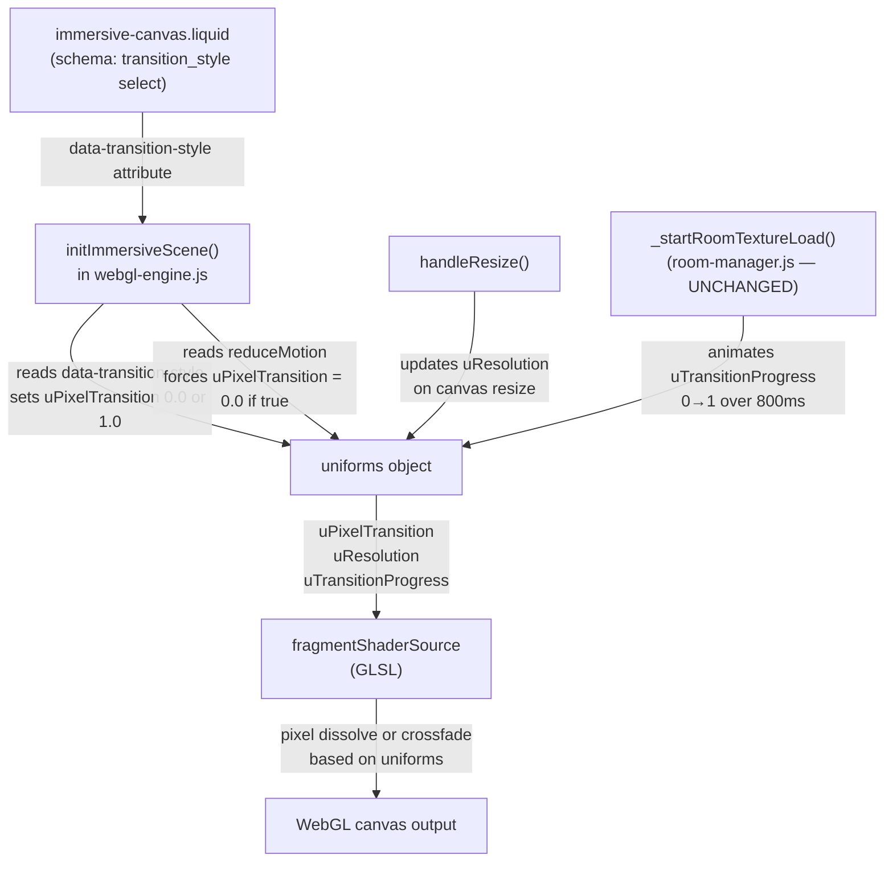

# Design Document: Pixel Room Transition

## Overview

This feature adds an optional **pixel dissolve** room transition effect to the Shahana Collection immersive store. The effect is implemented entirely in GLSL inside the existing `fragmentShaderSource` in `assets/immersive/core/webgl-engine.js` — no changes to the JavaScript transition loop, timing, or animation curve are required.

The pixel dissolve works in two phases driven by the existing `uTransitionProgress` uniform (0→1 over 800 ms):

- **Phase 1 (t 0→0.5):** The outgoing room texture (`uTexture1`) is sampled through a pixelation grid whose block size grows from 1 px to 32 px, creating a "pixelate out" effect.
- **Phase 2 (t 0.5→1):** The incoming room texture (`uTexture2`) is sampled through a pixelation grid whose block size shrinks from 32 px back to 1 px, creating a "pixelate in" effect.

At `t = 0` and `t = 1`, block size equals 1 px, so the transition starts and ends with a pixel-perfect sharp image — identical to the pre- and post-transition states.

Merchants choose between `crossfade` (existing behaviour) and `pixel_dissolve` via a `select` setting in the `immersive-canvas` section schema. The feature automatically falls back to the smooth crossfade when `prefers-reduced-motion` is enabled.

### Key design decisions

**Pure shader implementation.** The pixelation is computed entirely on the GPU. No per-frame CPU work is added beyond the existing `uTransitionProgress` uniform update. The `animate()` loop and `_startRoomTextureLoad()` transition loop are not modified.

**Re-sample with quantized UVs (not pre-computed color1/color2).** The pixel dissolve re-samples `uTexture1`/`uTexture2` with quantized UV coordinates rather than quantizing the already-computed `color1`/`color2` values. This means the pixelated frames include the parallax offset (via `parallaxUv()`) but do **not** include chromatic aberration. This is the correct trade-off: chromatic aberration is a scroll-linked post-processing effect that would look wrong applied to large pixel blocks, and the parallax offset is essential for the depth effect to remain coherent during the transition.

**Screen-space grid.** Block size is expressed in CSS pixels using a `uResolution` uniform, so the grid looks identical at all image resolutions and device pixel ratios.

**`var` convention.** All new JavaScript variables use `var`, consistent with the existing codebase.

---

## Architecture

The feature touches three files:

```
assets/immersive/core/webgl-engine.js   — shader source, uniforms, handleResize(), initImmersiveScene()
sections/immersive-canvas.liquid        — schema setting, data-transition-style attribute
```

No new files are created. No changes to `room-manager.js`, `immersive-store.js`, or any other file.



---

## Components and Interfaces

### 1. New uniforms

Two new uniforms are added to the `uniforms` object in `initImmersiveScene()`:

| Uniform | Type | Initial value | Purpose |
|---|---|---|---|
| `uPixelTransition` | `float` | `0.0` or `1.0` | Toggle: `0.0` = crossfade, `1.0` = pixel dissolve |
| `uResolution` | `vec2` | `new THREE.Vector2(width, height)` | Canvas dimensions in CSS pixels for screen-space grid |

`uPixelTransition` is set once at scene init and never changed at runtime. `uResolution` is updated in `handleResize()` whenever the canvas dimensions change.

### 2. `initImmersiveScene()` changes

After the `uniforms` object is constructed, read `data-transition-style` from the canvas wrapper and set `uPixelTransition`:

```javascript
// Read transition style from Liquid-rendered data attribute
var canvasWrapper = document.querySelector('.immersive-store__canvas-wrapper');
var transitionStyle = canvasWrapper && canvasWrapper.getAttribute('data-transition-style');
var pixelTransitionEnabled = (transitionStyle === 'pixel_dissolve') ? 1.0 : 0.0;

// Reduced motion always overrides merchant setting
if (reduceMotion) {
  pixelTransitionEnabled = 0.0;
  if (transitionStyle === 'pixel_dissolve') {
    console.info('[Immersive] Pixel dissolve suppressed: prefers-reduced-motion is enabled.');
  }
}

uniforms.uPixelTransition = { value: pixelTransitionEnabled };
uniforms.uResolution = { value: new THREE.Vector2(initWidth, initHeight) };
```

`initWidth` and `initHeight` are already computed earlier in `initImmersiveScene()` for the renderer size.

### 3. `handleResize()` addition

At the end of the existing resize logic, after `renderer.setSize()`:

```javascript
if (uniforms && uniforms.uResolution) {
  uniforms.uResolution.value.set(width, height);
}
```

### 4. Fragment shader changes

The existing step 4 in the fragment shader:

```glsl
vec4 color = mix(color1, color2, t);
```

is replaced with:

```glsl
// Pixel dissolve transition
uniform float uPixelTransition;
uniform vec2 uResolution;

vec4 color;
if (uPixelTransition > 0.5 && uReducedMotion < 0.5) {
  // Phase 1 (t 0→0.5): pixelate out uTexture1, block size 1→32px
  // Phase 2 (t 0.5→1): pixelate in uTexture2, block size 32→1px
  float blockSize;
  vec2 sampledUv;
  if (t < 0.5) {
    blockSize = clamp(1.0 + (t / 0.5) * 31.0, 1.0, 32.0);
    vec2 pixelCoords = floor(vUv * uResolution / blockSize) * blockSize;
    sampledUv = pixelCoords / uResolution;
    color = texture2D(uTexture1, parallaxUv(sampledUv, uDepth1, uMouse));
  } else {
    blockSize = clamp(32.0 - ((t - 0.5) / 0.5) * 31.0, 1.0, 32.0);
    vec2 pixelCoords = floor(vUv * uResolution / blockSize) * blockSize;
    sampledUv = pixelCoords / uResolution;
    color = texture2D(uTexture2, parallaxUv(sampledUv, uDepth2, uMouse));
  }
} else {
  // Standard crossfade (existing behaviour) — uses pre-computed color1/color2
  color = mix(color1, color2, t);
}
```

The `uniform` declarations for `uPixelTransition` and `uResolution` are added to the top of the shader source string alongside the existing uniform declarations.

**Note on chromatic aberration:** `color1` and `color2` (used in the crossfade branch) include chromatic aberration. The pixel dissolve branch re-samples directly from `uTexture1`/`uTexture2` with quantized UVs, bypassing chromatic aberration. This is intentional — chromatic aberration on large pixel blocks would produce visible colour fringing on block edges, which is visually incorrect. The parallax offset is preserved via `parallaxUv()`.

**Note on the `uReducedMotion` guard in the shader:** The shader checks `uReducedMotion < 0.5` as a secondary guard. The primary guard is in `initImmersiveScene()` which sets `uPixelTransition = 0.0` when `reduceMotion` is true. The shader guard is a belt-and-suspenders safety net for any edge case where the JS guard is bypassed.

### 5. `sections/immersive-canvas.liquid` schema addition

A new `select` setting is added to the `` block:

```json
{
  "type": "select",
  "id": "transition_style",
  "label": "t:sections.immersive_store.settings.transition_style.label",
  "options": [
    {
      "value": "crossfade",
      "label": "t:sections.immersive_store.settings.transition_style.option_crossfade"
    },
    {
      "value": "pixel_dissolve",
      "label": "t:sections.immersive_store.settings.transition_style.option_pixel_dissolve"
    }
  ],
  "default": "crossfade",
  "info": "t:sections.immersive_store.settings.transition_style.info"
}
```

The `data-transition-style` attribute is added to the canvas wrapper element:

```liquid
<div
  class="immersive-store__canvas-wrapper"
  data-base-url="{{ base_url }}"
  data-depth-url="{{ depth_url }}"
  data-logo-url="..."
  data-transition-style="{{ section.settings.transition_style | default: 'crossfade' | escape }}"
>
```

### 6. Locale keys

New keys added to `locales/en.default.json` under `sections.immersive_store.settings`:

```json
"transition_style": {
  "label": "Room transition style",
  "option_crossfade": "Smooth Crossfade",
  "option_pixel_dissolve": "Pixel Dissolve",
  "info": "Pixel Dissolve is automatically replaced with Smooth Crossfade for visitors who have enabled reduced motion in their OS settings."
}
```

And to `locales/en.default.schema.json` for the schema label translations.

---

## Data Models

### Uniform state

| Uniform | Set by | When | Value range |
|---|---|---|---|
| `uPixelTransition` | `initImmersiveScene()` | Once at scene init | `0.0` (crossfade) or `1.0` (pixel dissolve) |
| `uResolution` | `initImmersiveScene()`, `handleResize()` | Init + every resize | `[1, ∞) × [1, ∞)` CSS pixels |
| `uTransitionProgress` | `_startRoomTextureLoad()` (unchanged) | Each room transition | `[0.0, 1.0]` |
| `uReducedMotion` | `initImmersiveScene()` (unchanged) | Once at scene init | `0.0` or `1.0` |

### Block size formula

For `t = clamp(uTransitionProgress, 0.0, 1.0)`:

| Phase | Condition | Block size formula | Range |
|---|---|---|---|
| Phase 1 (pixelate out) | `t < 0.5` | `clamp(1.0 + (t / 0.5) * 31.0, 1.0, 32.0)` | `[1, 32]` px |
| Phase 2 (pixelate in) | `t >= 0.5` | `clamp(32.0 - ((t - 0.5) / 0.5) * 31.0, 1.0, 32.0)` | `[32, 1]` px |

At `t = 0`: block size = 1 (sharp, identical to pre-transition).
At `t = 0.5`: block size = 32 from both sides (continuous at crossover).
At `t = 1`: block size = 1 (sharp, identical to post-transition).

### UV quantization formula

```
pixelCoords = floor(vUv * uResolution / blockSize) * blockSize
sampledUv   = pixelCoords / uResolution
```

When `blockSize = 1.0`, `floor(x / 1.0) * 1.0 = floor(x)`. For integer pixel coordinates (which UV × resolution produces), `floor(x) = x`, so the quantization is identity — no visible grid.

---

## Correctness Properties

*A property is a characteristic or behavior that should hold true across all valid executions of a system — essentially, a formal statement about what the system should do. Properties serve as the bridge between human-readable specifications and machine-verifiable correctness guarantees.*

### Property 1: Block size is always in [1, 32] for all transition progress values

*For any* value of `uTransitionProgress` in `[0.0, 1.0]`, the computed block size SHALL be in the range `[1.0, 32.0]` pixels, with block size equal to `1.0` at both `t = 0.0` and `t = 1.0`, and equal to `32.0` at `t = 0.5` from both sides (continuity at the crossover point).

**Validates: Requirements 1.1, 1.2, 8.3, 8.4, 8.5**

### Property 2: Pixel dissolve inactive → output equals crossfade

*For any* value of `uTransitionProgress` in `[0.0, 1.0]`, when the pixel dissolve is inactive (either `uPixelTransition = 0.0` OR `uReducedMotion = 1.0`), the shader output SHALL equal `mix(color1, color2, t)` — identical to the existing smooth crossfade behaviour.

**Validates: Requirements 1.5, 4.2**

### Property 3: UV quantization snaps to correct screen-space grid

*For any* UV coordinate in `[0, 1]²`, canvas resolution `(W, H)` with `W, H ≥ 1`, and block size `b` in `[1.0, 32.0]`, the quantized UV coordinate produced by `floor(uv * res / b) * b / res` SHALL map to a pixel coordinate that is a multiple of `b` in screen space.

**Validates: Requirements 1.4, 5.3, 5.4**

---

## Error Handling

### WebGL not supported

No change to existing behaviour. `showWebGLFallback()` is called before uniforms are created, so `uPixelTransition` and `uResolution` are never referenced.

### Canvas wrapper not found

`initImmersiveScene()` already returns early if `canvas` or `uiLayer` is not found. The `data-transition-style` read is guarded:

```javascript
var canvasWrapper = document.querySelector('.immersive-store__canvas-wrapper');
var transitionStyle = canvasWrapper && canvasWrapper.getAttribute('data-transition-style');
```

If `canvasWrapper` is null or the attribute is absent, `transitionStyle` is `null`, and `pixelTransitionEnabled` defaults to `0.0` (crossfade). This is a safe fallback.

### Zero canvas dimensions

`handleResize()` already guards against zero dimensions:

```javascript
if (width === 0 || height === 0) return;
```

The `uResolution` update is placed after this guard, so it is never called with zero dimensions. Division by zero in the shader is prevented.

### `uTransitionProgress` out of range

The shader clamps `uTransitionProgress` to `[0.0, 1.0]` before computing block size:

```glsl
float t = clamp(uTransitionProgress, 0.0, 1.0);
```

This is already present in the existing shader and is preserved.

### Block size clamping

Both phase formulas use `clamp(..., 1.0, 32.0)` to prevent division by zero (block size = 0) and excessively large blocks. The minimum of `1.0` also ensures the quantization is identity at the transition boundaries.

---

## Testing Strategy

The test stack is **Jest + jsdom** for unit tests and **fast-check** for property-based tests, consistent with the existing codebase (`tests/` directory, `npm test`).

### Unit tests

Unit tests cover specific examples and edge cases:

- `uPixelTransition` is set to `1.0` when `data-transition-style="pixel_dissolve"` and `reduceMotion` is false.
- `uPixelTransition` is set to `0.0` when `data-transition-style="crossfade"`.
- `uPixelTransition` is set to `0.0` when `reduceMotion` is true, even if `data-transition-style="pixel_dissolve"`.
- `console.info` is called when `reduceMotion` is true and `transition_style` is `pixel_dissolve`.
- `uResolution` is updated in `handleResize()` to match the canvas dimensions.
- `uResolution` is initialized in `initImmersiveScene()` before `animate()` is called.
- Block size at `t = 0.0` equals `1.0`.
- Block size at `t = 0.5` equals `32.0` from both sides.
- Block size at `t = 1.0` equals `1.0`.

### Property-based tests (fast-check)

Each property test runs a minimum of **100 iterations** with randomly generated inputs. Each test is tagged with a comment referencing the design property.

**Property 1 test — Block size bounds:**

```javascript
// Feature: pixel-room-transition, Property 1: Block size is always in [1, 32]
fc.assert(fc.property(
  fc.float({ min: 0.0, max: 1.0 }),
  function (t) {
    var blockSize = computeBlockSize(t); // pure JS implementation of the GLSL formula
    return blockSize >= 1.0 && blockSize <= 32.0;
  }
), { numRuns: 100 });
```

Also verifies continuity at `t = 0.5`: `|computeBlockSize(0.5 - ε) - computeBlockSize(0.5 + ε)| < 0.01`.

**Property 2 test — Crossfade identity:**

```javascript
// Feature: pixel-room-transition, Property 2: Pixel dissolve inactive → output equals crossfade
fc.assert(fc.property(
  fc.float({ min: 0.0, max: 1.0 }),
  fc.constantFrom(0.0, 1.0), // uPixelTransition
  fc.constantFrom(0.0, 1.0), // uReducedMotion
  function (t, pixelTransition, reducedMotion) {
    // When inactive, output must equal mix(color1, color2, t)
    var inactive = pixelTransition < 0.5 || reducedMotion > 0.5;
    if (!inactive) return true; // only test inactive case
    var result = simulateShaderOutput(t, pixelTransition, reducedMotion, mockColor1, mockColor2);
    var expected = mix(mockColor1, mockColor2, t);
    return colorsEqual(result, expected);
  }
), { numRuns: 100 });
```

**Property 3 test — UV quantization:**

```javascript
// Feature: pixel-room-transition, Property 3: UV quantization snaps to correct screen-space grid
fc.assert(fc.property(
  fc.float({ min: 0.0, max: 1.0 }),  // uvX
  fc.float({ min: 0.0, max: 1.0 }),  // uvY
  fc.integer({ min: 1, max: 4096 }), // resW
  fc.integer({ min: 1, max: 4096 }), // resH
  fc.float({ min: 1.0, max: 32.0 }), // blockSize
  function (uvX, uvY, resW, resH, blockSize) {
    var pixelX = Math.floor(uvX * resW / blockSize) * blockSize;
    var pixelY = Math.floor(uvY * resH / blockSize) * blockSize;
    // Pixel coordinates must be multiples of blockSize
    return Math.abs(pixelX % blockSize) < 0.001 &&
           Math.abs(pixelY % blockSize) < 0.001;
  }
), { numRuns: 100 });
```

### Integration notes

The GLSL shader itself cannot be executed in Jest/jsdom (no WebGL). The property tests validate the **mathematical logic** of the shader formulas using equivalent pure JavaScript implementations. End-to-end visual correctness is verified manually in the browser.

The `computeBlockSize(t)` and `simulateShaderOutput(...)` helpers are pure JS implementations of the GLSL formulas, extracted into a testable module or inline in the test file.
